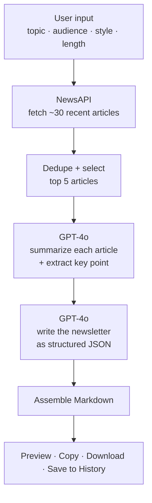

<!-- ───────────────────────────────────────────────────────────── -->
<div align="center">

⭐ **Star the repo:** https://github.com/adityasharmadotai-hash/amazing-ai-agents  
💼 **Follow on LinkedIn:** https://www.linkedin.com/in/aditya-hicounselor/  
📺 **Subscribe on YouTube:** https://www.youtube.com/channel/UCPjQtVNUrf7EKrm8ZoqrCAQ  
🚀 **Looking for jobs at top AI companies in the U.S.? Apply here:** https://docs.google.com/forms/d/e/1FAIpQLSc3gJssBV3B25EZ3sYA7Qcen9NbtOB_wgQaturfB7lTXuAdLQ/viewform

</div>

<!-- ───────────────────────────────────────────────────────────── -->

# 📰 Newsletter Content Creation Agent

> Generate complete, ready-to-send newsletters from the latest online news — in one click.

---

## 📖 Overview

Writing a newsletter is slow: you hunt for fresh articles, read them, figure out what matters, decide on an angle, and only *then* start drafting. The **Newsletter Content Creation Agent** collapses that whole loop into a single click.

You give it a **topic**, an **audience**, a **writing style**, and a **length**. The agent then:

1. **Researches** the latest news on your topic via NewsAPI,
2. **Summarizes** the best articles and pulls out the key insights with OpenAI GPT-4o,
3. **Writes** a full newsletter — title, subject line, intro, insights, conclusion, and a call-to-action,
4. Hands it back to you to **preview, copy, or download as Markdown**.

It's built with Streamlit, so the whole thing runs as a clean web app you can use locally or deploy publicly.


---

## ✨ Features

- **🔑 Local settings** — store your OpenAI + NewsAPI keys and default preferences (saved in a local SQLite file).
- **📝 Flexible inputs** — topic, target audience, 6 writing styles, and Short / Medium / Long length.
- **🔎 Smart research** — fetches recent articles, removes duplicates, and selects the top 5 most relevant + recent.
- **🧠 AI processing** — summarizes each article, extracts a key takeaway, then composes the edition.
- **🧾 Full newsletter output** — title, subject line, introduction, key insights, conclusion, CTA, and a sources list.
- **🖥️ One-click dashboard** — generate, live status updates, preview, copy-to-clipboard, and Markdown download.
- **🗂️ History** — every edition is saved and re-openable.
- **🎨 Clean modern UI** — dark theme, sidebar navigation, no clutter.

---

## ⚙️ How It Works



In plain English: **research → dedupe → summarize → write → format → deliver.** Two GPT-4o calls do the heavy lifting — one to digest the sources, one to write the edition from those digests.

---

## 🛠️ Tech Stack

| Layer | Technology | Why |
|-------|------------|-----|
| Language | **Python 3.9+** | Simple, readable, great ecosystem |
| UI | **Streamlit** | Build a polished web app with pure Python |
| AI | **OpenAI GPT-4o** | Summarization + newsletter writing |
| Research | **NewsAPI** | Recent news articles by topic |
| Storage | **SQLite** | Local persistence for settings + history |
| HTTP | **requests** | Calling the NewsAPI endpoint |

---

## 📁 File Structure

```
newsletter-content-agent/
├── app.py               # The entire app (UI + DB + research + AI + Markdown)
├── requirements.txt     # Python dependencies
├── .streamlit/
│   └── config.toml      # Dark theme configuration
├── README.md            # You are here
└── TUTORIAL.md          # Step-by-step beginner guide
```

> This agent is intentionally **single-file**: all logic lives in `app.py`. That keeps deployment dead simple — there are no local package imports to misconfigure.

---

## 🚀 Getting Started

### 1. Clone the repo

```bash
git clone https://github.com/adityasharmadotai-hash/amazing-ai-agents.git
cd amazing-ai-agents/agents/content-agents/newsletter-content-agent
```

### 2. Install dependencies

```bash
pip install -r requirements.txt
```

### 3. Run the app

```bash
streamlit run app.py
```

Your browser opens at `http://localhost:8501`.

### 4. Add your keys

Open **⚙️ Settings** in the sidebar and paste:

- **OpenAI API key** — from [platform.openai.com](https://platform.openai.com)
- **NewsAPI key** — free from [newsapi.org](https://newsapi.org)

Then go to **✍️ Create Newsletter** and generate your first edition.

---

## ☁️ Deployment (Streamlit Community Cloud)

1. Push your code to GitHub (it already lives in `amazing-ai-agents`).
2. Go to [share.streamlit.io](https://share.streamlit.io) and click **New app**.
3. Select the repo and branch (usually `main`).
4. Set **Main file path** to:
   ```
   agents/content-agents/newsletter-content-agent/app.py
   ```
5. Click **Deploy**.

**Important deployment notes:**

- Streamlit Cloud installs from a `requirements.txt`. Make sure one exists at the repo root **or** at the app folder so `streamlit`, `openai`, and `requests` get installed.
- Streamlit Cloud's filesystem is **ephemeral** — the local `newsletter.db` resets when the app reboots. For a public/production deployment, store keys via **[Streamlit secrets](https://docs.streamlit.io/develop/concepts/connections/secrets-management)** instead of the in-app Settings page, e.g.:
  ```toml
  # .streamlit/secrets.toml
  OPENAI_API_KEY = "sk-..."
  NEWSAPI_KEY = "..."
  ```
  …and read them with `st.secrets["OPENAI_API_KEY"]`. The in-app Settings flow is best for **local** use.

---

## 🤝 Contributing

Contributions are welcome!

1. Fork the repo
2. Create a branch: `git checkout -b feature/your-idea`
3. Commit your changes: `git commit -m "Add your idea"`
4. Push: `git push origin feature/your-idea`
5. Open a Pull Request

Ideas worth adding: scheduled generation, email-send integration, multiple newsletter templates, RSS sources alongside NewsAPI, or per-section tone controls.

---

## 📄 License

Released under the **MIT License** — free to use, modify, and build on.

---

## 📚 Tutorial

New to this? Follow the full, beginner-friendly walkthrough:
👉 **[TUTORIAL.md](https://github.com/adityasharmadotai-hash/docs-reader-rag-agent/blob/main/TUTORIAL.md)**

---

<div align="center">

Built as part of the **[amazing-ai-agents](https://github.com/adityasharmadotai-hash/amazing-ai-agents)** series.

If this helped you, drop a ⭐ on the repo!

</div>
