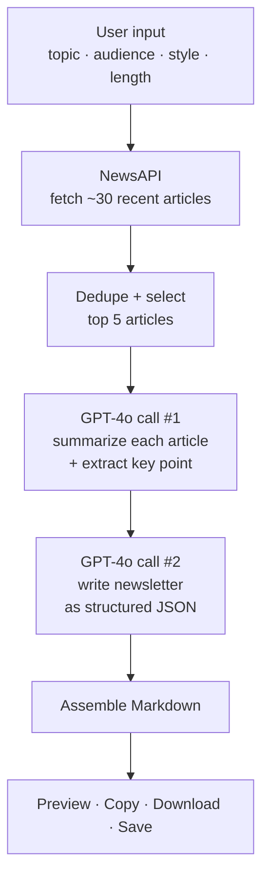

<!-- ───────────────────────────────────────────────────────────── -->
<div align="center">

⭐ **Star the repo:** https://github.com/adityasharmadotai-hash/amazing-ai-agents  
💼 **Follow on LinkedIn:** https://www.linkedin.com/in/aditya-hicounselor/  
📺 **Subscribe on YouTube:** https://www.youtube.com/channel/UCPjQtVNUrf7EKrm8ZoqrCAQ  
🚀 **Looking for jobs at top AI companies in the U.S.? Apply here:** https://docs.google.com/forms/d/e/1FAIpQLSc3gJssBV3B25EZ3sYA7Qcen9NbtOB_wgQaturfB7lTXuAdLQ/viewform

</div>

<!-- ───────────────────────────────────────────────────────────── -->

# 🧭 Tutorial: Build a Newsletter Content Creation Agent

A complete, beginner-friendly walkthrough. By the end you'll have a working AI app that researches the news and writes a full newsletter — and you'll understand every line that makes it tick.

---

## 📑 Table of Contents

1. [What We're Building (and Why)](#1-what-were-building-and-why)
2. [How It Works](#2-how-it-works)
3. [Prerequisites Checklist](#3-prerequisites-checklist)
4. [Project Setup](#4-project-setup)
5. [The Code, Explained Section by Section](#5-the-code-explained-section-by-section)
   - [5.1 Imports & Constants](#51-imports--constants)
   - [5.2 The Database (SQLite)](#52-the-database-sqlite)
   - [5.3 Content Research (NewsAPI)](#53-content-research-newsapi)
   - [5.4 AI Processing (OpenAI GPT-4o)](#54-ai-processing-openai-gpt-4o)
   - [5.5 Markdown Assembly](#55-markdown-assembly)
   - [5.6 Styling & Helpers](#56-styling--helpers)
   - [5.7 The UI & Pages](#57-the-ui--pages)
   - [5.8 requirements.txt & config.toml](#58-requirementstxt--configtoml)
6. [Run It Locally](#6-run-it-locally)
7. [Deploy on Streamlit Cloud](#7-deploy-on-streamlit-cloud)
8. [Common Errors and Fixes](#8-common-errors-and-fixes)
9. [What You Learned](#9-what-you-learned)
10. [What's Next](#10-whats-next)

---

## 1. What We're Building (and Why)

A **newsletter** is a great way to reach an audience — but producing one is tedious. Every edition means: search for fresh articles, read them, decide what matters, pick an angle, and write. That's an hour of work before you've drafted a single line.

We're going to build an **AI agent** that does the boring parts for us. You hand it four things:

- a **topic** (e.g. "AI agents"),
- a **target audience** (e.g. "AI engineers and founders"),
- a **writing style** (Professional, Casual, Storytelling, …),
- a **length** (Short, Medium, Long).

It then researches recent news, summarizes the best articles, and writes a complete newsletter you can copy or download. We'll use **Python** + **Streamlit** for the app, **NewsAPI** for research, and **OpenAI GPT-4o** for the thinking and writing.

> **Why "agent"?** Because it chains multiple steps — research, summarize, write — automatically toward a goal, rather than answering a single prompt.

---

## 2. How It Works



The mental model: **research → dedupe → summarize → write → format → deliver.** Two AI calls do the work — the first *understands* the sources, the second *writes* from that understanding. Splitting it this way keeps each prompt focused and the output reliable.

---

## 3. Prerequisites Checklist

Before we start, make sure you have:

- [ ] **Python 3.9 or newer** installed → check with `python --version`
- [ ] **pip** (comes with Python) → check with `pip --version`
- [ ] A code editor (VS Code is great)
- [ ] An **OpenAI API key** → create one at [platform.openai.com](https://platform.openai.com) (requires billing set up)
- [ ] A **NewsAPI key** → free at [newsapi.org](https://newsapi.org)
- [ ] Basic comfort with the terminal (running commands)

You do **not** need prior AI or Streamlit experience — we'll explain everything.

---

## 4. Project Setup

Create a folder and a single file:

```bash
mkdir newsletter-content-agent
cd newsletter-content-agent
touch app.py requirements.txt
mkdir .streamlit
touch .streamlit/config.toml
```

Your structure:

```
newsletter-content-agent/
├── app.py               # the whole app
├── requirements.txt     # dependencies
└── .streamlit/
    └── config.toml      # dark theme
```

> **Why one file?** Keeping everything in `app.py` means there are no local imports to misconfigure. This is the single biggest cause of "it works on my machine but breaks on Streamlit Cloud" — so we sidestep it entirely.

---

## 5. The Code, Explained Section by Section

We'll build `app.py` from top to bottom. Paste each section in order; together they form the complete file.

### 5.1 Imports & Constants

```python
import os
import re
import json
import sqlite3
from datetime import datetime
from contextlib import contextmanager

import requests
import streamlit as st
import streamlit.components.v1 as components
from openai import OpenAI, OpenAIError

# ---- Constants ----
DB_PATH = os.path.join(os.path.dirname(os.path.abspath(__file__)), "newsletter.db")
MODEL = "gpt-4o"
NEWSAPI_ENDPOINT = "https://newsapi.org/v2/everything"

STYLES = ["Professional", "Casual", "Storytelling", "Technical", "Witty", "Inspirational"]
LENGTHS = ["Short", "Medium", "Long"]
LENGTH_GUIDE = {
    "Short":  "around 250-350 words total, punchy and skimmable",
    "Medium": "around 500-650 words total, balanced detail",
    "Long":   "around 900-1100 words total, in-depth and thorough",
}

class NewsAPIError(Exception):
    pass

class AIError(Exception):
    pass
```

**What's happening:**

- We import the standard library helpers (`os`, `re`, `json`, `sqlite3`, dates) plus the three third-party packages: `requests` (for HTTP), `streamlit` (the UI), and `openai` (the AI).
- `DB_PATH` builds an absolute path to our database file *next to* `app.py`, using `__file__`. This matters on hosted platforms where the working directory isn't the app folder.
- `STYLES`, `LENGTHS`, and `LENGTH_GUIDE` are the menu of choices users get. `LENGTH_GUIDE` translates a friendly word ("Short") into an instruction the model understands ("~250-350 words").
- The two custom exceptions (`NewsAPIError`, `AIError`) let us catch *our* failures specifically and show friendly messages later.

---

### 5.2 The Database (SQLite)

SQLite is a tiny database that lives in a single file — perfect for storing settings and history without running a server.

```python
@contextmanager
def _conn():
    conn = sqlite3.connect(DB_PATH)
    conn.row_factory = sqlite3.Row
    try:
        yield conn
        conn.commit()
    finally:
        conn.close()

def init_db():
    with _conn() as conn:
        conn.execute(
            "CREATE TABLE IF NOT EXISTS settings (key TEXT PRIMARY KEY, value TEXT)"
        )
        conn.execute(
            """
            CREATE TABLE IF NOT EXISTS newsletters (
                id INTEGER PRIMARY KEY AUTOINCREMENT,
                title TEXT, subject TEXT, topic TEXT, audience TEXT,
                style TEXT, length TEXT, content_md TEXT, sources TEXT, created_at TEXT
            )
            """
        )

def set_setting(key, value):
    if not isinstance(value, str):
        value = json.dumps(value)         # store dicts/lists as JSON text
    with _conn() as conn:
        conn.execute(
            "INSERT INTO settings (key, value) VALUES (?, ?) "
            "ON CONFLICT(key) DO UPDATE SET value = excluded.value",
            (key, value),
        )

def get_setting(key, default=None):
    with _conn() as conn:
        row = conn.execute("SELECT value FROM settings WHERE key = ?", (key,)).fetchone()
    if row is None:
        return default
    try:
        return json.loads(row["value"])   # try to decode JSON back into a dict/list
    except (json.JSONDecodeError, TypeError):
        return row["value"]               # otherwise it was a plain string
```

**What's happening:**

- `_conn()` is a **context manager** (the `@contextmanager` decorator). It opens a connection, hands it to you, commits on success, and always closes — so you never leak a connection. `row_factory = sqlite3.Row` lets us read columns by name (`row["value"]`).
- `init_db()` creates two tables *if they don't already exist*: a simple `settings` key/value store, and a `newsletters` history table.
- `set_setting` uses an **UPSERT** (`ON CONFLICT … DO UPDATE`) so saving the same key twice updates it instead of erroring. Non-string values (like a preferences dict) are JSON-encoded.
- `get_setting` reverses that: it tries to JSON-decode; if that fails, the value was just a string (like an API key).

The same file also defines `save_settings`, `save_newsletter`, `list_newsletters`, `delete_newsletter`, and `count_newsletters` — straightforward wrappers around `INSERT`/`SELECT`/`DELETE`. For example:

```python
def save_newsletter(data: dict) -> int:
    with _conn() as conn:
        cur = conn.execute(
            """INSERT INTO newsletters
               (title, subject, topic, audience, style, length, content_md, sources, created_at)
               VALUES (?, ?, ?, ?, ?, ?, ?, ?, ?)""",
            (data.get("title", ""), data.get("subject", ""), data.get("topic", ""),
             data.get("audience", ""), data.get("style", ""), data.get("length", ""),
             data.get("content_md", ""), json.dumps(data.get("sources", [])),
             datetime.utcnow().isoformat(timespec="seconds")),
        )
        return cur.lastrowid     # the id of the row we just inserted
```

> **Security tip:** we always use `?` placeholders, never f-strings, when putting values into SQL. This prevents SQL injection.

---

### 5.3 Content Research (NewsAPI)

This layer fetches news, removes duplicates, and picks the best 5.

```python
def fetch_articles(topic, api_key, page_size=30, language="en", sort_by="publishedAt"):
    if not api_key:
        raise NewsAPIError("Missing NewsAPI key. Add it in Settings.")
    if not topic or not topic.strip():
        raise NewsAPIError("Please provide a newsletter topic.")

    params = {
        "q": topic.strip(), "language": language, "sortBy": sort_by,
        "pageSize": min(max(page_size, 1), 100), "apiKey": api_key,
    }
    try:
        resp = requests.get(NEWSAPI_ENDPOINT, params=params, timeout=20)
    except requests.RequestException as exc:
        raise NewsAPIError(f"Could not reach NewsAPI: {exc}") from exc

    if resp.status_code == 401:
        raise NewsAPIError("NewsAPI rejected the key (401). Check it in Settings.")
    if resp.status_code == 429:
        raise NewsAPIError("NewsAPI rate limit reached (429). Try again later.")

    data = resp.json()
    if data.get("status") != "ok":
        raise NewsAPIError(data.get("message", "Unknown NewsAPI error."))

    articles = [_clean_article(a) for a in data.get("articles", [])]
    return [a for a in articles if a["title"] and a["title"].lower() != "[removed]"]
```

**What's happening:**

- We validate inputs first (no key, no topic → friendly error).
- We call NewsAPI's `/everything` endpoint with the topic as the search query, sorted by most recent, asking for up to 30 articles.
- We translate specific HTTP status codes into clear messages: **401** = bad key, **429** = rate limited. This is much friendlier than a raw stack trace.
- NewsAPI sometimes returns placeholder articles titled `[Removed]`; we filter those out.

Now the **deduplication and selection**:

```python
def deduplicate(articles: list) -> list:
    seen_titles, seen_urls, unique = set(), set(), []
    for art in articles:
        norm = _normalize_title(art["title"])
        url = art["url"]
        if norm in seen_titles or (url and url in seen_urls):
            continue
        seen_titles.add(norm)
        if url:
            seen_urls.add(url)
        unique.append(art)
    return unique

def select_top(articles: list, count: int = 5) -> list:
    unique = deduplicate(articles)
    with_body = [a for a in unique if a["description"] or a["content"]]
    without_body = [a for a in unique if not (a["description"] or a["content"])]
    with_body.sort(key=_published_key, reverse=True)
    without_body.sort(key=_published_key, reverse=True)
    return (with_body + without_body)[:count]

def research(topic, api_key, count=5):
    return select_top(fetch_articles(topic, api_key), count=count)
```

**What's happening:**

- `deduplicate` tracks the titles and URLs we've already seen. `_normalize_title` lowercases and strips punctuation so "AI Agents Take Off" and "ai agents take off!" count as the *same* story.
- `select_top` prefers articles that actually have body text (better raw material for the AI), then sorts everything newest-first, and keeps the top 5.
- `research` is a one-line convenience wrapper: fetch → dedupe → top 5.

---

### 5.4 AI Processing (OpenAI GPT-4o)

This is the brain. Two functions, one per AI call.

First, a small helper that protects us from messy model output:

```python
def _parse_json(text: str):
    cleaned = text.strip()
    if cleaned.startswith("```"):                 # strip markdown code fences
        parts = cleaned.split("```", 2)
        cleaned = parts[1] if len(parts) > 1 else text
        if cleaned.lstrip().startswith("json"):
            cleaned = cleaned.lstrip()[4:]
    cleaned = cleaned.strip().strip("`").strip()
    try:
        return json.loads(cleaned)
    except json.JSONDecodeError as exc:
        raise AIError(f"Model returned unparseable JSON: {exc}") from exc
```

Models sometimes wrap their JSON in Markdown code fences (a `json` block). This helper strips those fences so `json.loads` doesn't choke.

**Call #1 — summarize each article:**

```python
def summarize_articles(articles, api_key):
    client = OpenAI(api_key=api_key)

    blocks = []
    for i, art in enumerate(articles, 1):
        body = art.get("description") or ""
        extra = art.get("content") or ""
        blocks.append(f"[{i}] TITLE: {art['title']}\nSOURCE: {art.get('source','')}\n"
                      f"TEXT: {body} {extra}".strip())
    sources_text = "\n\n".join(blocks)

    system = ("You are a sharp editorial research assistant. You read raw news "
              "snippets and distill them into clean, factual summaries. Never "
              "invent facts that are not present in the provided text.")
    user = ("Summarize each numbered article below. For every article produce: a "
            "2-3 sentence neutral summary, and one standout key takeaway.\n\n"
            'Return ONLY valid JSON: { "articles": [ { "index": 1, "summary": '
            '"...", "key_point": "..." } ] }\n\n'
            f"ARTICLES:\n{sources_text}")

    resp = client.chat.completions.create(
        model=MODEL, temperature=0.3,
        response_format={"type": "json_object"},
        messages=[{"role": "system", "content": system},
                  {"role": "user", "content": user}],
    )
    parsed = _parse_json(resp.choices[0].message.content)
    # ...re-attach source/url to each summary by index...
```

**What's happening:**

- We package all 5 articles into one numbered prompt — a single API call instead of five, which is faster and cheaper.
- The **system message** sets the role and a guardrail: *don't invent facts.*
- `temperature=0.3` keeps summaries factual and consistent (low temperature = less random).
- `response_format={"type": "json_object"}` tells OpenAI to **guarantee valid JSON**, so parsing is reliable.

**Call #2 — write the newsletter:**

```python
def generate_newsletter(topic, audience, style, length, summaries, api_key):
    client = OpenAI(api_key=api_key)
    length_hint = LENGTH_GUIDE.get(length, LENGTH_GUIDE["Medium"])

    research_text = "\n\n".join(
        f"- {s['title']} ({s['source']})\n  Summary: {s['summary']}\n  Key point: {s['key_point']}"
        for s in summaries
    )
    system = ("You are an expert newsletter writer ... You match the requested "
              "tone precisely and write only from the provided research.")
    user = (f"Write a newsletter edition.\n\nTOPIC: {topic}\nAUDIENCE: {audience}\n"
            f"STYLE: {style}\nLENGTH: {length_hint}\n\nRESEARCH:\n{research_text}\n\n"
            'Return ONLY valid JSON: { "title": "...", "subject_line": "...", '
            '"introduction": "...", "key_insights": [ { "heading": "...", '
            '"body": "..." } ], "conclusion": "...", "cta": "..." }')

    resp = client.chat.completions.create(
        model=MODEL, temperature=0.7,
        response_format={"type": "json_object"},
        messages=[{"role": "system", "content": system},
                  {"role": "user", "content": user}],
    )
    return _parse_json(resp.choices[0].message.content)
```

**What's happening:**

- We feed the **summaries** (not the raw articles) plus the user's topic/audience/style/length into one prompt.
- `temperature=0.7` is higher here — writing benefits from a bit of creativity, while summarizing wanted precision.
- We ask for a strict JSON shape with every newsletter part as a separate field, so the next step can format it cleanly.

> **Key idea:** by making the model return **structured JSON** instead of free text, we get predictable building blocks (title, subject, insights…) that our code can lay out exactly how we want.

---

### 5.5 Markdown Assembly

The AI returns JSON; this turns it into a polished Markdown document.

```python
def build_markdown(generated: dict, summaries=None, include_sources=True) -> str:
    summaries = summaries or []
    lines = []
    title = generated.get("title", "").strip() or "Untitled Newsletter"

    lines += [f"# {title}", ""]
    if generated.get("subject_line"):
        lines += [f"**Subject line:** {generated['subject_line'].strip()}", ""]
    lines += [f"*{datetime.utcnow().strftime('%B %d, %Y')}*", "", "---", ""]

    if generated.get("introduction"):
        lines += [generated["introduction"].strip(), ""]

    if generated.get("key_insights"):
        lines += ["## Key Insights", ""]
        for i, ins in enumerate(generated["key_insights"], 1):
            heading = ins.get("heading", "").strip()
            lines.append(f"### {i}. {heading}" if heading else f"### {i}.")
            lines += ["", ins.get("body", "").strip(), ""]

    if generated.get("conclusion"):
        lines += ["## Conclusion", "", generated["conclusion"].strip(), ""]
    if generated.get("cta"):
        lines += ["---", "", f"**{generated['cta'].strip()}**", ""]

    if include_sources and summaries:
        lines += ["---", "", "### Sources", ""]
        for s in summaries:
            label = s.get("title", "Source")
            if s.get("source"):
                label += f" — *{s['source']}*"
            lines.append(f"- [{label}]({s['url']})" if s.get("url") else f"- {label}")
    return "\n".join(lines).strip() + "\n"
```

**What's happening:**

- We build a list of lines and `join` them at the end — cleaner than concatenating strings repeatedly.
- Each newsletter part becomes Markdown: `#` for the title, `##` for section headers, `**bold**` for the CTA, and `[text](url)` links for sources.
- `include_sources` appends a linked list of every article the AI drew from — good for transparency and credibility.

---

### 5.6 Styling & Helpers

A block of CSS gives the app its clean dark look, injected via `st.markdown(..., unsafe_allow_html=True)`. There's also a small **copy-to-clipboard** button built with a tiny piece of JavaScript:

```python
def copy_button(text, label="📋 Copy to clipboard"):
    payload = json.dumps(text)   # safely escape the text for JS
    components.html(f"""
        <button id="copybtn" ...>{label}</button>
        <script>
            document.getElementById("copybtn").addEventListener("click", async () => {{
                await navigator.clipboard.writeText({payload});
                ...
            }});
        </script>
    """, height=56)
```

Streamlit has no native copy button, so we drop in a real HTML/JS one with `components.html`. `json.dumps(text)` safely turns the newsletter into a JavaScript string (escaping quotes and newlines).

Small helpers round things out: `_has_keys()` checks both API keys are set, `_slug()` makes a safe filename from the title, and `_safe_index()` avoids crashes when a saved preference is missing.

---

### 5.7 The UI & Pages

Finally, the Streamlit interface. First, page config, database init, and a demo seed:

```python
st.set_page_config(page_title="Newsletter Agent", page_icon="📰",
                   layout="wide", initial_sidebar_state="expanded")
init_db()
seed_if_empty()    # adds 2 sample newsletters the first time
inject_css()
```

**The sidebar** is our navigation:

```python
with st.sidebar:
    st.markdown('<div class="sidebar-brand">📰 Newsletter <span>Agent</span></div>',
                unsafe_allow_html=True)
    page = st.radio("Navigation",
                    ["📊 Dashboard", "✍️ Create Newsletter", "🗂️ History", "⚙️ Settings"],
                    label_visibility="collapsed")
```

`st.radio` returns whichever item the user picked; we store it in `page` and use it to decide what to show.

**The Create page** collects inputs in a form and runs the pipeline:

```python
def _run_generation(topic, audience, style, length, num_articles):
    openai_key = get_setting("openai_key")
    newsapi_key = get_setting("newsapi_key")
    try:
        with st.status("Working on your newsletter…", expanded=True) as status:
            status.write("🔎 Researching the latest news…")
            articles = research(topic, newsapi_key, count=num_articles)

            status.write("🧠 Summarizing and extracting insights…")
            summaries = summarize_articles(articles, openai_key)

            status.write("✍️ Writing the newsletter…")
            generated = generate_newsletter(topic, audience, style, length, summaries, openai_key)

            md = build_markdown(generated, summaries)
            status.update(label="Newsletter ready!", state="complete")

        save_newsletter({...})                  # persist to history
        st.session_state["result"] = {...}      # remember for display
    except NewsAPIError as exc:
        st.error(f"News research failed: {exc}")
    except AIError as exc:
        st.error(f"AI processing failed: {exc}")
```

**What's happening:**

- `st.status(...)` shows a live, expandable progress panel — the user watches each step happen.
- We call our three functions in sequence: `research → summarize_articles → generate_newsletter → build_markdown`.
- The result is saved to history **and** stashed in `st.session_state` so it survives Streamlit's reruns and stays on screen.
- Our custom exceptions become friendly red error boxes instead of crashes.

The result is then shown with a **Preview / Markdown** tab pair, plus the copy button and a `st.download_button` for the `.md` file. The **Settings** page is a simple form that calls `save_settings(...)`, and **History** lists saved editions from the database.

At the very bottom, a tiny **router** ties it together:

```python
if page.startswith("📊"):
    render_dashboard()
elif page.startswith("✍️"):
    render_create()
elif page.startswith("🗂️"):
    render_history()
elif page.startswith("⚙️"):
    render_settings()
```

---

### 5.8 requirements.txt & config.toml

**`requirements.txt`** — the packages to install:

```
streamlit>=1.36.0
openai>=1.30.0
requests>=2.31.0
```

**`.streamlit/config.toml`** — the dark theme:

```toml
[theme]
base = "dark"
primaryColor = "#6366f1"
backgroundColor = "#0f1117"
secondaryBackgroundColor = "#1a1d28"
textColor = "#e5e7eb"

[browser]
gatherUsageStats = false
```

Streamlit reads this automatically and applies the colors — no extra code needed.

---

## 6. Run It Locally

```bash
pip install -r requirements.txt
streamlit run app.py
```

A browser tab opens at `http://localhost:8501`. Then:

1. Click **⚙️ Settings** → paste your OpenAI and NewsAPI keys → **Save**.
2. Click **✍️ Create Newsletter** → enter a topic, audience, style, length → **✨ Generate**.
3. Watch the status panel, then **preview**, **copy**, or **download** your newsletter.

---

## 7. Deploy on Streamlit Cloud

1. Push your code to GitHub.
2. Go to [share.streamlit.io](https://share.streamlit.io) → **New app**.
3. Choose your repo and branch (usually `main`).
4. Set **Main file path** to your `app.py` (include the full path if it's in a subfolder, e.g. `agents/content-agents/newsletter-content-agent/app.py`).
5. Click **Deploy**. Done.

**Two things to know:**

- Streamlit Cloud installs from `requirements.txt`. If your app is in a subfolder, make sure a `requirements.txt` is reachable (repo root is safest).
- Cloud storage is **ephemeral** — the local `newsletter.db` resets on reboot, so saved keys won't persist. For a public deployment, put keys in **Streamlit secrets** (`.streamlit/secrets.toml`) and read them with `st.secrets[...]` instead of the in-app Settings page.

---

## 8. Common Errors and Fixes

| Error | Cause | Fix |
|-------|-------|-----|
| `ModuleNotFoundError: No module named 'modules'` | App split across files and the package folder isn't on the import path (common on Streamlit Cloud with nested folders) | Use this **single-file** `app.py` — no local imports to break. Or ensure the package folder + its `__init__.py` are committed and add the app dir to `sys.path`. |
| `ModuleNotFoundError: No module named 'openai'` | Dependencies not installed | Run `pip install -r requirements.txt`; on Cloud, confirm `requirements.txt` is found |
| "NewsAPI rejected the key (401)" | Wrong/expired NewsAPI key | Re-copy the key from newsapi.org into Settings |
| "NewsAPI rate limit reached (429)" | Free-tier limit hit | Wait and retry; the free tier is generous but capped |
| "No usable articles" | Topic too narrow, or older than NewsAPI's free 30-day window | Broaden the topic or try a more current one |
| "OpenAI … failed" | Bad key, no billing, or no model access | Check the key, your OpenAI billing, and GPT-4o access |
| Saved keys disappear after deploy | Ephemeral Cloud filesystem | Use `st.secrets` for hosted apps (see Deployment) |

> **The `modules` error in particular** is worth internalizing: on Streamlit Cloud the app often launches from the repo root, not your app folder, so `from modules import ...` can't find a sibling package. The cleanest cure is to keep everything in one file — which is exactly what we did.

---

## 9. What You Learned

By building this, you now know how to:

- ✅ Structure a **multi-step AI agent** (research → summarize → write).
- ✅ Call a **third-party API** (NewsAPI) with `requests` and handle errors gracefully.
- ✅ Use **OpenAI GPT-4o** with system/user roles, temperature, and **guaranteed JSON output**.
- ✅ Split AI work into focused calls for **reliability** (low-temp summary, higher-temp writing).
- ✅ Persist data locally with **SQLite** (UPSERTs, parameterized queries).
- ✅ Build a clean **Streamlit** app — sidebar nav, forms, live status, tabs, downloads, custom CSS, and a JS copy button.
- ✅ **Deploy** to Streamlit Cloud and avoid the classic import/secrets pitfalls.

---

## 10. What's Next

Ideas to extend the agent:

- **📧 Send it:** integrate an email API (e.g. Resend or SendGrid) to actually deliver editions.
- **🗓️ Schedule it:** add a cron/scheduler to auto-generate a weekly edition.
- **📡 More sources:** pull from RSS feeds or Reddit alongside NewsAPI.
- **🎨 Templates:** offer multiple newsletter layouts (digest, deep-dive, listicle).
- **🌍 Multilingual:** generate the same edition in several languages.
- **📊 Analytics:** track which topics/styles you generate most.

Pick one, build it, and share what you made!

---

<div align="center">

Built as part of the **[amazing-ai-agents](https://github.com/adityasharmadotai-hash/amazing-ai-agents)** series.

⭐ Star the repo · 💼 Connect on LinkedIn · 📺 Subscribe on YouTube

</div>
