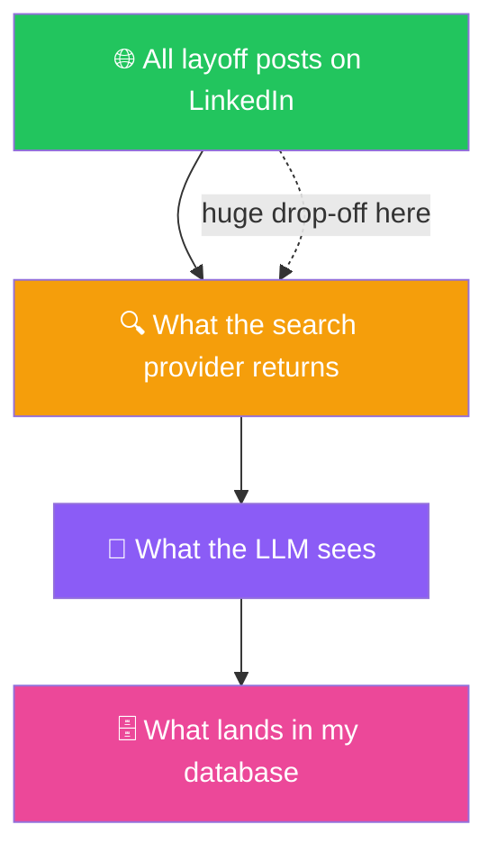
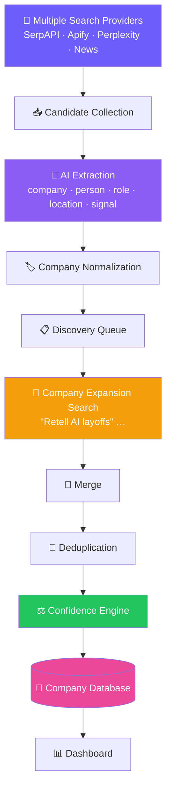
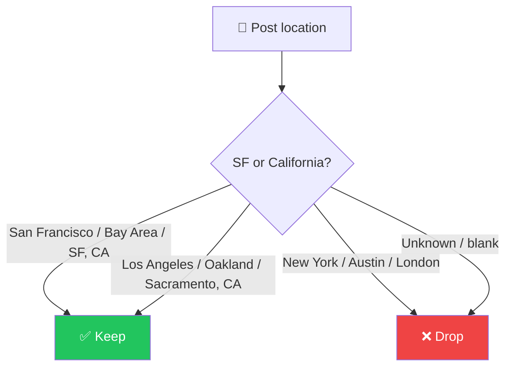
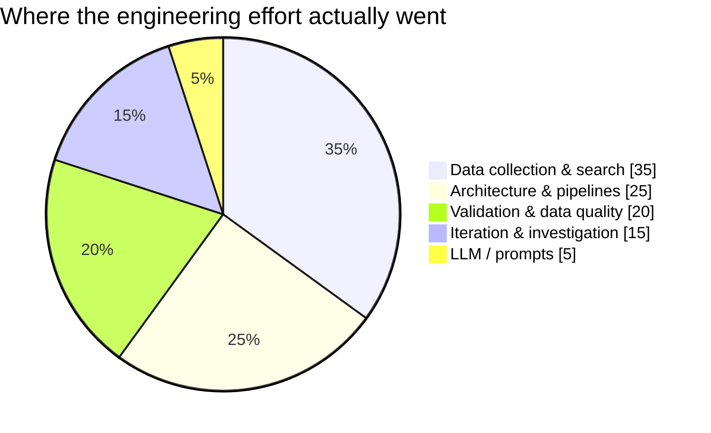

# 🛠️ The Engineering Journey Behind LayoffScout AI

> A first-person case study of building a layoff-discovery engine — including the parts that broke, the assumptions that were wrong, and how the architecture changed once I understood the real problem.

This is **not** a README. It's the story of how a naive `Search → Extract → Store` script turned into a multi-provider **Company Discovery Engine** — and everything I learned in between. If you found this from my LinkedIn post: the honest version is that most of the hard work had nothing to do with the LLM.

---

## 📑 Table of Contents

1. [Why I Started This Project](#1--why-i-started-this-project)
2. [My Initial Assumption](#2--my-initial-assumption)
3. [The First Prototype](#3--the-first-prototype)
4. [What Went Wrong](#4--what-went-wrong)
5. [The Real Problem](#5--the-real-problem)
6. [Investigation](#6--investigation)
7. [Engineering Challenges](#7--engineering-challenges)
8. [The Architecture Evolution](#8--the-architecture-evolution)
9. [The Company Discovery Engine](#9--the-company-discovery-engine)
10. [California & San Francisco Filtering](#10--california--san-francisco-filtering)
11. [Lessons Learned](#11--lessons-learned)
12. [Technical Stack](#12--technical-stack)
13. [Future Roadmap](#13--future-roadmap)
14. [Final Thoughts](#14--final-thoughts)
15. [Contributing](#15--contributing)

---

## 1. 🎯 Why I Started This Project

Layoffs move fast, and the people affected are often the strongest hires on the market — for a short window, before everyone else finds them. I wanted a system that could **automatically discover layoff events** and surface the affected talent, with a specific focus on **San Francisco and California**, where a lot of my target hiring happens.

The idea was simple to state:

> **Continuously watch for companies laying people off, extract who was affected and where, and turn that into a clean, queryable list of leads.**

Recruiters do this manually today — scrolling LinkedIn, checking [layoffs.fyi](https://layoffs.fyi), reading TechCrunch. I wanted to compress that into a pipeline. What I didn't appreciate at the start was that the *watching* part — discovery — would be by far the hardest piece.

---

## 2. 💡 My Initial Assumption

My first mental model was almost embarrassingly straightforward. I assumed that if I searched LinkedIn for the obvious terms:

```text
layoff
#layoff
laid off
```

…I would find essentially **every** company having layoffs. LinkedIn is where people post about losing their jobs. The hashtag exists. How hard could it be?

> [!NOTE]
> This assumption felt logical at the time, and that's exactly why it was dangerous. It was a **coverage assumption disguised as a search query.** I assumed the search surface *was* LinkedIn. It wasn't.

---

## 3. 🧱 The First Prototype

The original architecture was three boxes:


Concretely:

1. **Search** — hit a search provider with a handful of layoff keywords.
2. **Extract** — feed each returned post to Gemini and pull out `company`, `person`, `role`, `location`, `is_layoff`.
3. **Store** — write structured rows to a database.

It worked on the first run. I got leads. I saw company names. I felt done.

I was not done.

---

## 4. ⚠️ What Went Wrong

The moment I started **manually comparing** my app's output against LinkedIn and layoffs.fyi, the illusion collapsed:

| What I observed | Reality |
| --- | --- |
| 🕳️ **Many companies were missing** | My app found a small slice of what a manual search showed |
| 🚀 **Startups never appeared** | Small/private companies were almost entirely absent |
| 📋 **layoffs.fyi had companies I never found** | Even *well-documented* layoffs slipped through |
| 🔎 **Manual LinkedIn returned far more posts** | The same keyword returned an order of magnitude more results by hand |

> [!WARNING]
> This was my first real engineering surprise. The pipeline wasn't *crashing* — it was quietly under-delivering. Those are the worst kind of bugs, because everything *looks* like it's working. My database had rows in it. The rows just represented a fraction of reality.

I remember thinking the extraction must be dropping things. So I went looking in the wrong place first.

---

## 5. 🔑 The Real Problem

Here's the lesson that reframed the entire project:

> [!IMPORTANT]
> **The AI wasn't failing. The search providers were.**
>
> If a LinkedIn post is never *returned* by the search provider, the LLM never gets the chance to extract it. You cannot extract information you never receive.

I had been optimizing prompts, tweaking the extraction schema, tuning temperature — and none of it mattered, because the bottleneck was **upstream** of the model. My funnel looked like this:



The giant loss happened between "everything that exists" and "what the provider hands back." Prompt engineering operates on the **last** box. My problem lived in the **first arrow**.

Once I internalized that, the project stopped being "an LLM app" and became "a **discovery** and **data-pipeline** problem that happens to use an LLM for one step."

---

## 6. 🔬 Investigation

I stopped guessing and started measuring. I wired up each provider behind a common interface and compared them against manual LinkedIn searches on identical keywords.

### Provider-by-provider findings

| Provider | What it actually does | Where it shines | Where it struggles |
| --- | --- | --- | --- |
| **SerpAPI** | Returns Google's *index* of public LinkedIn posts (`site:linkedin.com/posts`) | Cheap, fast, easy to start | Only sees the fraction of LinkedIn that Google has indexed (most posts are login-walled); **thin snippets** that often don't name the company |
| **Apify** | Actually scrapes LinkedIn's own post search | **Full post text**, highest volume, reaches posts Google never indexed | Paid per post; LinkedIn barely understands boolean queries, so keywords need flattening |
| **Perplexity** | Live web search via the `/search` API, returns real result pages | Real, current URLs with citations; supports a `country` filter | Returns only a **handful** of top citations per query — precise, not exhaustive |
| **Gemini** | Google Search *grounding* | No extra API key (reuses the Gemini key) | ❌ **Cannot find individual LinkedIn posts at all** — see below |
| **NewsAPI** | News articles about layoffs | High-confidence, names the company | Only surfaces **large/known** companies — the opposite of the gap I cared about |

### The Gemini rabbit hole (an honest detour)

I really wanted Gemini web search to work, because it needed no extra key. I spent real time on it, and here's the unvarnished result:

- On the pinned legacy SDK (`google-generativeai==0.8.3`), the Google Search grounding tool **errored out entirely** with `gemini-2.5` models.
- The ungrounded fallback did something worse than fail — it **hallucinated real-looking-but-fake post URLs** (correct handle, invented activity ID). Those are dead links that pollute the database.
- I even installed the newer `google-genai` SDK to test proper grounding. Grounding *ran* — but Google's grounding index **does not contain individual LinkedIn posts**. Every query came back with blog/news articles *about* layoffs (`fastcompany.com`, `washingtonpost.com`), **zero** `linkedin.com/posts` URLs. On top of that, the new SDK required `httpx>=0.28`, which **conflicted with the Supabase client** (`httpx<0.28`).

> [!NOTE]
> **Conclusion:** No amount of SDK-wrangling makes Gemini a LinkedIn *discovery* provider, because the posts simply aren't in Google's grounded index. So I kept Gemini for what it's genuinely good at — **extraction** — and stopped pretending it could search. Sometimes the right engineering decision is to stop investing in a dead end.

---

## 7. 🧩 Engineering Challenges

Discovery being hard was just the headline. Underneath were a stack of gnarly, unglamorous problems.

### 🚀 Missing startup companies
Big companies (Amazon, Disney) surface everywhere. **Small startups don't** — they have no press coverage, aren't on layoffs.fyi, and their employees post in plain language, not with hashtags. Reaching them required searching **employee language** ("today was my last day at…", "impacted by layoffs at…") rather than keywords, then extracting the employer from the sentence.

### ✂️ Thin snippets
SerpAPI/Perplexity often return a one-line snippet that never names the company. In my data review, **44% of stored posts had no company extracted** — not because the model failed, but because the *input* didn't contain the company. Only Apify's full post text reliably fixed this.

### 🏷️ Company normalization
The same company appears under many names:

```text
Amazon      Amazon AGI     Amazon.com
Monday      monday.com
Retell      Retell AI      Retell.ai      Retell Inc
```

I built a canonicalization key (lowercase, strip corporate suffixes like `Inc`/`LLC`/`Technologies`), but chose to **keep "AI"** deliberately — stripping it would wrongly merge `OpenAI` → `Open`. The honest tradeoff: `Retell` and `Retell AI` still fragment. Conservative-but-safe beats aggressive-but-wrong.

### 🔁 Duplicate posts
The same post arrives via multiple providers, multiple URLs, and reposts. URL-only dedup isn't enough; I normalize URLs (drop query/fragment/case) and dedup across providers, keeping the richest text on collision.

### 📍 Location extraction & unknown locations
Roughly **half** of posts state no location. That single fact broke my first location filter (see §10).

### 📊 Confidence scoring
One anonymous post ≠ a confirmed layoff. I needed a way to say "8 employees + 2 recruiters + 1 founder all named this company" is *far* stronger than one post — which led to the confidence engine.

---

## 8. 🏗️ The Architecture Evolution

The three-box prototype grew into a real pipeline, one stage at a time — each stage introduced to fix a specific failure above.

### Old architecture


### New architecture



### Why each stage exists

| Stage | The problem it solves |
| --- | --- |
| **Multiple Providers** | No single provider sees enough of LinkedIn — merge to widen coverage |
| **Candidate Collection** | Normalize every provider's output into one shape (`{url, text, provider, …}`) |
| **AI Extraction** | Turn messy post text into structured fields |
| **Company Normalization** | Collapse name variants so one company = one record |
| **Discovery Queue** | Track newly discovered companies for a second pass |
| **Company Expansion Search** | Once a company is known, search *for it directly* to find posts the generic search missed |
| **Merge + Deduplication** | Combine passes/providers without double-counting |
| **Confidence Engine** | Score how sure we are, from independent signals |
| **Company Database** | The company — not the post — becomes the primary entity |

---

## 9. 🧠 The Company Discovery Engine

Somewhere in this process the project's center of gravity shifted. It stopped being "a LinkedIn scraper" and became a **Company Discovery Engine**. The post is just *evidence*; the **company** is the thing I actually care about.

The engine has six moving parts:


- **🔌 Search providers** — a pluggable interface; adding a provider means implementing one `search(queries)` function.
- **🤖 Extraction** — the LLM pulls the employer out of casual phrasing ("my last day at **X**") and classifies the poster: employee / recruiter / founder / company / news.
- **🏷️ Normalization** — canonical keys merge `Retell.ai` and `Retell AI`.
- **🔎 Expansion** — the key idea. When the first pass discovers "Retell AI", the engine automatically runs a **second pass** of company-specific searches:

  ```text
  "Retell AI" layoffs
  "Retell AI" restructuring
  "Retell AI" open to work
  ```

  This finds additional posts — often from *other* employees at the same startup — that the generic keyword search missed.
- **🧹 Deduplication** — across providers and passes.
- **⚖️ Confidence** — a **noisy-OR** over weighted, independent signals:

  | Signal | Weight | Reasoning |
  | --- | --- | --- |
  | 📰 News article | 0.80 | A journalist confirmed it |
  | 🏢 Company announcement | 0.80 | Official source |
  | 👔 Founder / exec | 0.70 | Insider confirmation |
  | 🧑‍💼 Recruiter | 0.45 | Second-hand but informed |
  | 🧑‍💻 Employee (self) | 0.38 | Direct but singular |
  | 💬 Other / mention | 0.12 | Weak signal |

  `confidence = 1 − Π(1 − weight)^count`. So 8 employees + 2 recruiters + 1 founder ≈ **99%**, while a single anonymous post is ~38%. Many weak signals stack; one strong signal lands high on its own.

> [!IMPORTANT]
> **A budget governor keeps expansion honest.** Expansion is combinatorial (`companies × queries × providers`) and could drain API keys in a single scan. The engine caps how many companies it expands per scan and **hard-aborts once the running spend crosses a ceiling**. Coverage is a dial, not an accident.

---

## 10. 🌉 California & San Francisco Filtering

I only care about **San Francisco and California**. This should have been the easy part. It was not.

### The bug: unknown locations inflated everything

My first filter said "keep it if the location matches SF **or** if the location is unknown (benefit of the doubt)." That sounded generous and safe. Then I actually counted:

> [!WARNING]
> Of **350 stored posts**, only **8 were confirmably San Francisco.** But over **100 were marked "in-location"** — because ~46% of posts had **no location at all**, and my "benefit of the doubt" rule waved every one of them through. My "SF leads" were mostly *location-unknown* leads wearing an SF label.

The filter wasn't filtering. It was a no-op with good intentions.

### The redesign



I made two changes:
1. **Match SF *or* anywhere in California** — the city alone was too narrow (it missed `Los Angeles, California`, `Oakland, California`).
2. **Made it strict** — unknown-location posts are **no longer** given the benefit of the doubt.

And I made the **company view location-aware** too: a company appears in the SF/California view only if at least one of its posts is actually in-location.

> [!NOTE]
> This is an honest tradeoff, not a magic fix. Strict filtering **reduces** the qualified count, because so many posts lack a stated location. The real long-term fix isn't loosening the filter — it's **better location extraction** (profile enrichment). I chose *correct-but-fewer* over *inflated-but-wrong.*

---

## 11. 🎓 Lessons Learned

The lessons that actually changed how I build:

> [!TIP]
> **1. Search quality > AI quality.** The best model in the world can't extract a post it never receives. My biggest wins came from the *retrieval* layer, not the prompt.

> [!TIP]
> **2. AI cannot extract information it never gets.** Coverage is a precondition for accuracy. I spent days tuning extraction before realizing the input set was the problem.

> [!TIP]
> **3. Discovery is harder than extraction.** Extraction is a solved-ish problem with a good LLM. *Finding the right things to extract* is where the real engineering lives.

> [!TIP]
> **4. Small startups need different search strategies.** Keywords and hashtags find big companies. Employee *language* ("today was my last day") finds the startups nobody's written about.

> [!TIP]
> **5. Architecture matters more than prompt engineering.** Adding an expansion pass and a merge stage moved the needle far more than any prompt rewrite.

> [!TIP]
> **6. Good data pipelines beat bigger models.** A well-plumbed multi-provider pipeline with a cheap model out-discovers a single provider with an expensive one.

And a bonus, learned the hard way in production:

> [!WARNING]
> **7. Validate at the boundary.** An LLM returned `"September 2025"` for a Postgres `date` column, and PostgREST rejected the **entire batch** — one bad value took down a whole scan. I now coerce and validate every typed field before it hits the database. Deployment also taught me that pinning your dependencies to a Python version and *actually testing that version* is not optional.

---

## 12. 🧰 Technical Stack

| Technology | Role | Why I chose it |
| --- | --- | --- |
| 🐍 **Python** | Core language | Best ecosystem for data pipelines, HTTP, and LLM SDKs |
| 🎈 **Streamlit** | Dashboard & UI | Fastest path from script to a shareable, interactive app |
| ✨ **Gemini** | AI extraction | Cheap, fast, strong structured-JSON extraction (`gemini-2.5-flash`) |
| 🟠 **Perplexity** | Search provider | Live web search returning real LinkedIn URLs + citations, with a country filter |
| 🟢 **SerpAPI** | Search provider | Cheap, easy on-ramp to Google-indexed LinkedIn posts |
| 🔵 **Apify** | Search provider | The coverage workhorse — full LinkedIn post text, reaches non-indexed posts |
| 📰 **NewsAPI** | Search provider | High-confidence layoff *events* for well-known companies |
| 🐘 **Supabase (Postgres)** | Database | Managed Postgres + instant REST (PostgREST), no ORM needed |

> [!NOTE]
> The stack is deliberately **modular**: providers sit behind a shared interface, extraction is one swappable step, and storage is plain REST. Nothing here is exotic — the value is in how the pieces are *arranged*, not in any single tool.

---

## 13. 🗺️ Future Roadmap

Honest about what's next — and what's still weak today.

- [ ] **Better startup discovery** — expand the employee-language dictionary; weight the long tail so small companies surface instead of being buried under Amazon/Disney.
- [ ] **Company monitoring (continuous discovery)** — a `needs_rescan` queue so discovered companies are re-mined on a schedule (high-confidence daily, others less often).
- [ ] **Improved location detection** — more aggressive profile enrichment to cut the ~46% "unknown location" rate that currently starves the SF/California filter.
- [ ] **Semantic deduplication** — catch reposts and near-duplicate text, not just matching URLs.
- [ ] **More search providers** — the interface is ready; adding one is a single module.
- [ ] **Better confidence scoring** — tune weights against labeled outcomes; down-weight low-quality sources.
- [ ] **Richer analytics dashboard** — companies discovered today, expansion lift, posts-by-provider, confidence distribution.
- [ ] **Automated monitoring** — an external scheduler (Streamlit Cloud can't run background jobs) to run scans and alert on new high-confidence companies.

---

## 14. 💭 Final Thoughts

When I started, I thought this was an "LLM project." I'd call an API, get magic, ship it.

What building LayoffScout AI actually taught me is that **real-world AI engineering is mostly *not* the AI.** The LLM is one box in a much larger system. The work that determined whether the product succeeded or failed was:



- **Data collection & search** — the coverage problem that defined the project.
- **Architecture** — merge, normalize, expand, dedup, score.
- **Pipelines** — moving data reliably between stages.
- **Validation** — stopping one bad value from taking down a batch.
- **Iteration** — measuring, being wrong, and rebuilding.

The LLM is a genuinely powerful *component*. But a powerful component in a weak system is still a weak system. The engineering — the boring, essential plumbing — is what turns a demo into something useful.

If there's one line to take away: **AI is one part of the system, and usually not the hard part.**

---

## 15. 🤝 Contributing

This is a real, imperfect, in-progress system — which makes it a great place to contribute. If any of the challenges above sparked ideas, I'd love the help.

Good places to jump in:

- 🐛 **Open an Issue** — bugs, missed companies, wrong locations, or ideas.
- 🔀 **Submit a Pull Request** — small and focused is welcome.
- 🔌 **Improve search providers** — add a provider, raise coverage, or fix keyword handling. The provider interface makes this the highest-leverage contribution.
- 🤖 **Improve AI extraction** — better company-name extraction (that 44%-missing number is begging to come down), poster-role classification, or location inference.
- 🏢 **Improve company discovery** — normalization/alias merging, expansion query strategies, confidence tuning, semantic dedup.

> [!NOTE]
> Contributions that improve **coverage** and **data quality** are worth more here than any model upgrade — because, as this whole journey argues, that's where the real problem lives.

---

<div align="center">

*Built with curiosity, broken a few times, and rebuilt honestly.*
**⭐ If this engineering story was useful, star the repo and share it.**

</div>
