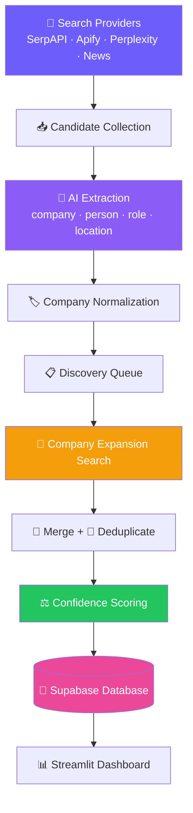

# 🎯 LayoffScout AI

**An AI-powered Company Discovery Engine that finds companies laying people off — across LinkedIn and news — and turns the affected talent into clean, queryable leads, focused on San Francisco & California.**

> ⭐ **Star the repo:** https://github.com/adityasharmadotai-hash/amazing-ai-agents
> 💼 **Follow on LinkedIn:** https://www.linkedin.com/in/aditya-hicounselor/
> 📺 **Subscribe on YouTube:** https://www.youtube.com/channel/UCPjQtVNUrf7EKrm8ZoqrCAQ
> 🚀 **Looking for jobs at top AI companies in the U.S.?** [Apply here](https://docs.google.com/forms/d/e/1FAIpQLSc3gJssBV3B25EZ3sYA7Qcen9NbtOB_wgQaturfB7lTXuAdLQ/viewform)

---

## 📖 Overview

When a company has layoffs, the affected people are some of the strongest hires on the market — for a short window before everyone else finds them. Recruiters track this manually: scrolling LinkedIn, checking [layoffs.fyi](https://layoffs.fyi), reading tech news. **LayoffScout AI automates that.**

The hard part isn't reading a post — a good LLM does that easily. The hard part is **discovery**: reliably *finding* the posts in the first place, especially for **small startups and private companies** that never make the news. LayoffScout treats this as a search-and-coverage problem: it merges multiple search providers, extracts the company and person with AI, then runs a **second-pass expansion search** for each discovered company to surface posts the generic search missed.


> [!NOTE]
> The full engineering story — including what broke and why — is in **[DEVELOPMENT_JOURNEY.md](DEVELOPMENT_JOURNEY.md)**.

---

## ✨ Features

- 🔌 **Multi-provider discovery** — merges **SerpAPI + Apify + Perplexity + NewsAPI** in one scan and de-duplicates across them.
- 🗣️ **Employee-language search** — searches phrases people actually post (`"today was my last day"`, `"impacted by the layoffs"`), which is how small startups surface.
- 🤖 **AI extraction** — Gemini pulls out the **company, person, role, location, layoff signal**, and classifies the poster (employee / recruiter / founder / company / news).
- 🔎 **Company expansion** — once a company is found, it auto-searches `"<company> layoffs"`, `"<company> restructuring"`, etc. to find more posts.
- 🏢 **Company Discovery database** — the company is the primary entity, with a **confidence score** that rises as independent signals stack up.
- 📍 **San Francisco & California scoping** — a strict location filter on both leads and companies.
- 💰 **Budget governor** — expansion hard-stops once a scan crosses a spend ceiling.
- 📊 **Streamlit dashboard** — scan, browse leads & companies, cost tracking, single-post analyzer, and optional email enrichment (Wiza).

---

## ⚙️ How It Works



1. **Search** every configured provider with a dictionary of layoff phrases (searched independently).
2. **Extract** each post with Gemini into a structured record.
3. **Normalize** company names so `Retell AI` = `Retell.ai`.
4. **Expand** — re-search each discovered company to find more posts.
5. **Merge, dedupe, and score** confidence from independent signals.
6. **Store** in Supabase and browse in the dashboard.

---

## 🧰 Tech Stack

| Technology | Role | Why |
| --- | --- | --- |
| 🐍 **Python 3.12** | Core language | Best ecosystem for data pipelines + LLM SDKs |
| 🎈 **Streamlit** | Dashboard & UI | Fastest path from script to shareable app |
| ✨ **Google Gemini** | AI extraction | Cheap, fast, strong structured-JSON extraction |
| 🟢 **SerpAPI** | Search provider | Cheap Google-indexed LinkedIn posts |
| 🔵 **Apify** | Search provider | Full LinkedIn post text; reaches non-indexed posts |
| 🟠 **Perplexity** | Search provider | Live web search returning real LinkedIn URLs |
| 📰 **NewsAPI** | Search provider | High-confidence layoff events for known companies |
| 🐘 **Supabase (Postgres)** | Database | Managed Postgres + instant REST (PostgREST) |
| ✉️ **Wiza** *(optional)* | Contact enrichment | Turn a profile into a verified work email |
| 🔗 **httpx / tenacity** | HTTP + retries | Lightweight, no heavy ORM |

---

## 📁 File Structure

```text
layoff-detection-linkedin/
├── streamlit_app.py            # Entry point / router (st.navigation, callable pages)
├── st_common.py                # Config keys, secrets bootstrap, brand CSS
├── requirements.txt            # Pinned deps (deploy on Python 3.12)
├── .env.example                # Copy to .env and fill in keys
├── agent/
│   ├── config.py               # All settings + query dictionary + expansion knobs
│   ├── llm.py                  # Shared Gemini client (complete_json)
│   ├── extract.py              # LLM: post text → structured record
│   ├── pipeline.py             # Orchestrates a scan (2-pass: collect→extract→expand→store)
│   ├── discovery.py            # Company-expansion engine + budget governor
│   ├── companies.py            # Company rollup: normalization + confidence
│   ├── store.py                # Supabase persistence (raw httpx / PostgREST)
│   ├── usage.py                # Cost / credit tracking
│   ├── enrich_location.py      # Resolve unknown location via profile scrape (Apify)
│   ├── enrich.py               # Wiza email enrichment (optional)
│   ├── logbus.py               # Log capture helper
│   └── sources/
│       ├── linkedin.py         # SerpAPI backend + provider orchestrator (merge/dedupe)
│       ├── apify_linkedin.py   # Apify LinkedIn scrape backend
│       ├── perplexity_search.py# Perplexity /search backend
│       ├── gemini_search.py    # Gemini grounding backend (kept for completeness)
│       └── news.py             # NewsAPI backend
├── views/
│   ├── dashboard.py            # Scan, Leads, Companies, Analyze, Enrich, History
│   └── settings.py             # API keys + options UI
└── supabase/
    ├── layoff_posts.sql        # Leads table schema
    └── companies.sql           # Companies rollup table + migration
```

---

## 🚀 Getting Started

### 1. Clone

```bash
git clone https://github.com/adityasharmadotai-hash/amazing-ai-agents.git
cd amazing-ai-agents/agents/layoff-detection-linkedin
```

### 2. Install (Python 3.12 recommended)

```bash
python -m venv .venv
source .venv/bin/activate      # Windows: .venv\Scripts\activate
pip install -r requirements.txt
```

### 3. Set up Supabase

Create a free project at [supabase.com](https://supabase.com), then run **both** files in the Supabase **SQL Editor**:

```text
supabase/layoff_posts.sql     # leads table
supabase/companies.sql        # companies rollup table
```

### 4. Add your keys

```bash
cp .env.example .env
```

Fill in `.env` (only the **required** ones are mandatory):

| Key | Required? | Where to get it |
| --- | --- | --- |
| `GEMINI_API_KEY` | ✅ | https://aistudio.google.com/app/apikey |
| `SUPABASE_URL` | ✅ | Supabase → Project Settings → Data API |
| `SUPABASE_SERVICE_KEY` | ✅ | Supabase → Project Settings → API keys (service_role) |
| `SERPAPI_KEY` | ◻️ | https://serpapi.com |
| `APIFY_TOKEN` | ◻️ | https://apify.com → Settings → API tokens |
| `PERPLEXITY_API_KEY` | ◻️ | https://www.perplexity.ai/settings/api |
| `NEWSAPI_KEY` | ◻️ | https://newsapi.org |
| `WIZA_API_KEY` | ◻️ | https://wiza.co (only for email enrichment) |

> `LINKEDIN_SOURCE=all` merges every provider you have a key for. Add at least one search key (SerpAPI / Apify / Perplexity).

### 5. Run

```bash
streamlit run streamlit_app.py
```

Open the local URL, go to **⚙️ Settings** to confirm your keys, then click **⚡ Scan New Data** on the dashboard.

---

## ☁️ Deployment (Streamlit Community Cloud)

1. Push this repo to GitHub.
2. On [share.streamlit.io](https://share.streamlit.io), create an app pointing to `agents/layoff-detection-linkedin/streamlit_app.py`.
3. In **Advanced settings**, set **Python version → `3.12`**.
   > [!WARNING]
   > The pinned dependencies have no wheels for Python 3.13/3.14 — on newer Python, `pillow`/`pandas` compile from source and the build **fails on missing zlib**. Pin **3.12** and it installs from wheels cleanly.
4. Paste your keys into **⋮ → Settings → Secrets** in TOML form (the Settings page shows a ready-to-copy template).
5. Run the two Supabase migrations (above) once.

---

## 🤝 Contributing

Contributions are welcome — this is a real, imperfect, in-progress system.

- 🐛 **Open an Issue** for bugs, missed companies, or ideas.
- 🔀 **Submit a PR** — small and focused is best.
- 🔌 **Add or improve a search provider** (the provider interface makes this the highest-leverage contribution).
- 🤖 **Improve AI extraction** — better company-name extraction, location inference, poster-role classification.

> Contributions that improve **coverage** and **data quality** are worth more here than any model upgrade.

---

## 📚 Tutorial

New to the stack? Follow the full step-by-step build guide in this repo:

👉 **[Read the Tutorial →](TUTORIAL.md)**

---

## 📄 License

Released under the **MIT License**. Use it, fork it, learn from it.

---

<div align="center">

**Built by [Aditya](https://www.linkedin.com/in/aditya-hicounselor/)** · ⭐ Star the repo if it helped you

</div>
