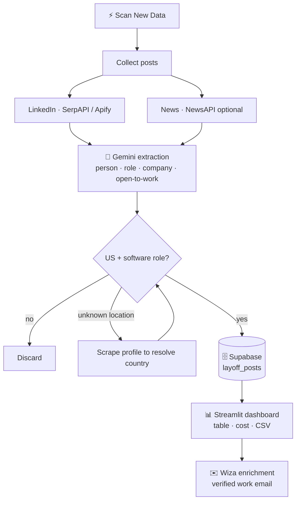

# 🎯 LayoffScout AI

> An AI agent that finds **US software-engineering candidates from LinkedIn & news layoff posts**, extracts them with Google Gemini, and turns them into recruiter-ready leads — all in a single Streamlit app.

---

⭐ **Star the repo:** https://github.com/adityasharmadotai-hash/amazing-ai-agents
💼 **Follow on LinkedIn:** https://www.linkedin.com/in/aditya-hicounselor/
📺 **Subscribe on YouTube:** https://www.youtube.com/channel/UCPjQtVNUrf7EKrm8ZoqrCAQ
🚀 **Looking for jobs at top AI companies in the U.S.? Apply here:** https://docs.google.com/forms/d/e/1FAIpQLSc3gJssBV3B25EZ3sYA7Qcen9NbtOB_wgQaturfB7lTXuAdLQ/viewform

---

## 📖 Overview

When a company runs layoffs, hundreds of talented engineers post "I've been impacted…"
or "#OpenToWork" on LinkedIn within days. For a recruiter, that is a goldmine of
warm, available candidates — but reading, filtering, and organizing those posts by
hand is slow and easy to miss.

**LayoffScout AI** automates the whole funnel:

1. **Searches** LinkedIn (and optionally news articles) for recent layoff / open-to-work posts.
2. **Reads each post with AI** (Google Gemini) to pull out the person, their role, their
   company, whether they were laid off, and whether they're open to work.
3. **Filters** down to the target audience — US-based candidates in software-engineering roles.
4. **Stores** qualified leads in a Supabase database (deduped by post URL).
5. **Enriches** any lead into a verified work email with one click (via Wiza).
6. **Tracks cost** of every scan (scraping + AI tokens) so you always know your spend.

Everything is presented in a clean Streamlit dashboard with a dedicated **Settings**
page that walks you through generating every API key.

**The problem it solves:** turning a noisy, fast-moving stream of social posts into a
structured, filtered, contactable candidate list — without manual sifting.

---

## ✨ Features

- 🔎 **Pick your source** — a simple toggle on the Settings page: **SerpAPI only** (free tier, easiest — Apify not needed at all) *or* Apify (paid, full LinkedIn scrape). Plus optional NewsAPI.
- 🤖 **AI extraction** — Gemini reads each post and returns structured fields (person, role, company, open-to-work, summary).
- 🎯 **Smart filtering** — keeps only US-based software engineers (36 target job titles), with profile-scrape fallback to resolve unknown locations.
- 🗄️ **Persistent storage** — Supabase (Postgres) with automatic dedupe on post URL.
- ✉️ **One-click enrichment** — turn a profile into a verified work email via Wiza.
- 💰 **Live cost tracking** — per-scan and cumulative spend across Apify, Gemini, and SerpAPI.
- 📥 **CSV export** — download the leads table any time.
- ⚙️ **Guided Settings page** — every API key with step-by-step "how to generate it" instructions.
- 🛠️ **No-code retargeting** — change the **search keywords**, **target job titles/roles**, and **target locations/countries** right from the Settings page. Point it at data scientists in Canada, designers worldwide, anything — no code edits.
- 🔗 **Analyze a single URL** — paste one LinkedIn post to test the pipeline instantly.

---

## 🔄 How it works



**In one sentence:** *scrape recent layoff posts → let AI read them → keep US software
engineers → store & enrich them → show it all in a dashboard.*

---

## 🧰 Tech stack

| Layer | Technology | Why |
|-------|-----------|-----|
| UI / hosting | **Streamlit** + Streamlit Community Cloud | Fast to build, free public hosting |
| AI extraction | **Google Gemini** (`google-generativeai`) | Reads unstructured posts → structured JSON |
| LinkedIn source | **SerpAPI** or **Apify** | Cheap Google-indexed snippets vs. full LinkedIn scrape |
| News source | **NewsAPI** (optional) | Extra layoff signal from articles |
| Database | **Supabase** (Postgres + PostgREST) | Free managed Postgres with a REST API |
| Enrichment | **Wiza** (optional) | Profile → verified work email |
| HTTP | **httpx** | Direct REST calls (no heavy SDKs) |
| Data | **pandas** | Table rendering + CSV export |
| Language | **Python 3.10+** | — |

---

## 📁 File structure

```
layoff-detection-linkedin/
├── streamlit_app.py            # Main dashboard (Streamlit entry point)
├── st_common.py                # Secrets ↔ env bridge + config key metadata
├── pages/
│   └── 1_Settings.py           # API keys page with generation instructions
├── agent/                      # The reusable pipeline (UI-agnostic)
│   ├── config.py               # Reads env vars → typed settings
│   ├── pipeline.py             # Orchestrates collect → extract → store
│   ├── extract.py              # Turns a post into a structured record
│   ├── llm.py                  # Single Gemini helper (complete_json)
│   ├── enrich.py               # Wiza work-email lookup
│   ├── enrich_location.py      # Profile scrape → resolve country
│   ├── store.py                # Supabase upsert / list (via httpx)
│   ├── usage.py                # Cost + credit tracking per scan
│   ├── logbus.py               # Log fan-out helper
│   └── sources/
│       ├── linkedin.py         # SerpAPI / Apify LinkedIn search
│       ├── apify_linkedin.py   # Apify actor client
│       └── news.py             # NewsAPI source
├── supabase/
│   └── layoff_posts.sql        # Table schema — run once in Supabase
├── requirements.txt            # Python dependencies
├── .streamlit/
│   ├── config.toml             # Theme + server config
│   └── secrets.toml.example    # Template for local/cloud secrets
├── .env.example                # Template for local .env
├── README.md
└── TUTORIAL.md                 # Full beginner walkthrough
```

---

## 🚀 Getting started

### 1. Clone

```bash
git clone https://github.com/adityasharmadotai-hash/amazing-ai-agents.git
cd amazing-ai-agents/layoff-detection-linkedin   # or wherever this project lives
```

### 2. Install

```bash
python -m venv .venv
# Windows:  .venv\Scripts\activate
# macOS/Linux:
source .venv/bin/activate

pip install -r requirements.txt
```

### 3. Configure keys

Copy the template and fill in your keys:

```bash
cp .streamlit/secrets.toml.example .streamlit/secrets.toml
```

Then edit `.streamlit/secrets.toml`. **Minimum to run (SerpAPI-only):**
`GEMINI_API_KEY`, `SUPABASE_URL`, `SUPABASE_SERVICE_KEY`, and `SERPAPI_KEY` —
**no Apify account required.** (Only add `APIFY_TOKEN` if you switch the source to
Apify on the Settings page.) Don't have the keys yet? Just start the app — the
**Settings** page has a source picker and step-by-step instructions for generating
each one.

### 4. Create the database table

In your Supabase project, open the **SQL Editor** and run the contents of
[`supabase/layoff_posts.sql`](supabase/layoff_posts.sql).

### 5. Run

```bash
streamlit run streamlit_app.py
```

Open http://localhost:8501, go to **⚙️ Settings** to confirm your keys, then click
**⚡ Scan New Data** on the dashboard.

---

## ☁️ Deployment (Streamlit Community Cloud)

1. Push this project to a **public GitHub repo**.
2. Go to **https://share.streamlit.io** and sign in with GitHub.
3. Click **Create app → Deploy a public app from GitHub**.
4. Select your repo, branch (`main`), and set **Main file path** to `streamlit_app.py`.
5. Click **Advanced settings → Secrets** and paste your keys in TOML form
   (use `.streamlit/secrets.toml.example` as the template — the Settings page also
   generates a ready-to-paste block for you).
6. Click **Deploy**. In ~1 minute you get a public URL like
   `https://your-app.streamlit.app` — perfect for a LinkedIn post. 🎉

> 🔒 **Never commit real keys.** `.gitignore` already excludes `.env` and
> `.streamlit/secrets.toml`. Keys live only in the Streamlit Cloud **Secrets** box.

---

## 🤝 Contributing

Contributions are welcome!

1. Fork the repo and create a branch: `git checkout -b feature/my-idea`
2. Make your change and test it locally with `streamlit run streamlit_app.py`.
3. Commit, push, and open a Pull Request describing what and why.

Good first issues: add a new source, add filters to the dashboard, or add tests for
the extractor.

---

## 📄 License

Released under the **MIT License** — free to use, modify, and share. See `LICENSE`
(add one if you fork this for your own use).

---

## 📚 Full tutorial

New to this? The step-by-step, beginner-friendly build guide is in
**[TUTORIAL.md](TUTORIAL.md)**.

A companion tutorial for a related project is here:
👉 https://github.com/adityasharmadotai-hash/docs-reader-rag-agent/blob/main/TUTORIAL.md
