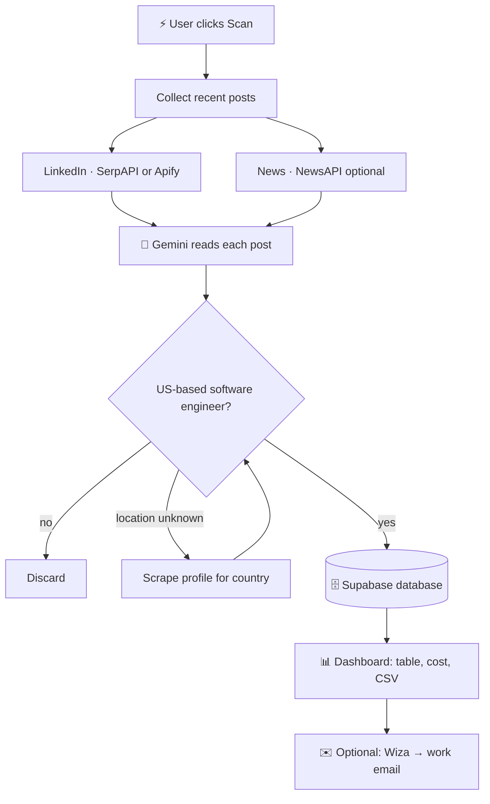

# 🎓 Build LayoffScout AI — Step-by-Step Tutorial

> A complete, beginner-friendly walkthrough. By the end you'll have a live,
> public Streamlit app that scrapes layoff posts, reads them with AI, and builds a
> filtered candidate list — deployed for free and ready to share on LinkedIn.

---

⭐ **Star the repo:** https://github.com/adityasharmadotai-hash/amazing-ai-agents
💼 **Follow on LinkedIn:** https://www.linkedin.com/in/aditya-hicounselor/
📺 **Subscribe on YouTube:** https://www.youtube.com/channel/UCPjQtVNUrf7EKrm8ZoqrCAQ
🚀 **Looking for jobs at top AI companies in the U.S.? Apply here:** https://docs.google.com/forms/d/e/1FAIpQLSc3gJssBV3B25EZ3sYA7Qcen9NbtOB_wgQaturfB7lTXuAdLQ/viewform

---

## 📑 Table of contents

1. [What we're building and why](#1-what-were-building-and-why)
2. [How it works (flow diagram)](#2-how-it-works)
3. [Prerequisites checklist](#3-prerequisites-checklist)
4. [Project setup](#4-project-setup)
5. [Getting your API keys](#5-getting-your-api-keys)
6. [Each file explained (with code)](#6-each-file-explained)
   - [6.1 `agent/config.py`](#61-agentconfigpy--all-settings-in-one-place)
   - [6.2 `agent/llm.py`](#62-agentllmpy--talking-to-gemini)
   - [6.3 `agent/extract.py` (concept)](#63-agentextractpy--post--structured-record)
   - [6.4 `agent/store.py`](#64-agentstorepy--saving-to-supabase)
   - [6.5 `agent/usage.py`](#65-agentusagepy--tracking-cost)
   - [6.6 `agent/pipeline.py`](#66-agentpipelinepy--the-orchestra-conductor)
   - [6.7 `st_common.py`](#67-st_commonpy--bridging-secrets-and-config)
   - [6.8 `streamlit_app.py`](#68-streamlit_apppy--the-dashboard)
   - [6.9 `pages/1_Settings.py`](#69-pages1_settingspy--the-settings-page)
7. [How to run locally](#7-how-to-run-locally)
8. [How to deploy on Streamlit Cloud](#8-how-to-deploy-on-streamlit-cloud)
9. [Common errors and fixes](#9-common-errors-and-fixes)
10. [What you learned](#10-what-you-learned)
11. [What's next](#11-whats-next)

---

## 1. What we're building and why

We're building an **AI agent** — a program that uses a Large Language Model (LLM)
to make decisions and extract information from messy, real-world data.

**The scenario:** every time a tech company announces layoffs, hundreds of engineers
post about it on LinkedIn ("I was impacted by the recent layoffs", "#OpenToWork").
A recruiter would love a clean, filtered list of those people — but reading posts by
hand is slow.

**Our agent does it automatically:**

- Finds recent layoff / open-to-work posts.
- Uses **Google Gemini** to read each post and pull out structured facts.
- Keeps only **US-based software engineers**.
- Saves them to a database and shows them in a dashboard.
- Optionally finds each person's **work email**.

**Why this is a great project to learn from:** it touches everything a modern AI
app needs — web data, an LLM, filtering logic, a database, cost tracking, a UI, and
cloud deployment — but each piece is small and readable.

---

## 2. How it works



Read it as: **collect → understand with AI → filter → store → display → enrich.**

---

## 3. Prerequisites checklist

Before you start, make sure you have:

- [ ] **Python 3.10 or newer** — check with `python --version`.
- [ ] **A code editor** — VS Code is great and free.
- [ ] **A GitHub account** — for storing code and deploying.
- [ ] **Basic terminal comfort** — running commands like `cd` and `pip install`.
- [ ] **~30 minutes** and a willingness to copy-paste API keys.

**Accounts you'll create (all have free tiers):**

- [ ] Google AI Studio (Gemini) — **required**
- [ ] Supabase (database) — **required**
- [ ] SerpAPI **or** Apify (LinkedIn search) — **required, pick one**
- [ ] NewsAPI — optional
- [ ] Wiza — optional (email enrichment)

You don't need to sign up for everything up front — the app's **Settings** page
tells you exactly how to get each key when you need it.

---

## 4. Project setup

If you're cloning the finished project:

```bash
git clone https://github.com/adityasharmadotai-hash/amazing-ai-agents.git
cd amazing-ai-agents/layoff-detection-linkedin
```

Create and activate a **virtual environment** (an isolated space for this project's
Python packages):

```bash
python -m venv .venv

# Windows (PowerShell):
.venv\Scripts\Activate.ps1

# macOS / Linux:
source .venv/bin/activate
```

Install the dependencies:

```bash
pip install -r requirements.txt
```

`requirements.txt` looks like this — each line is a package we depend on:

```text
streamlit==1.39.0            # the web UI + hosting
pandas==2.2.3                # tables and CSV export
httpx==0.27.2                # making HTTP/API calls
pydantic==2.9.2              # data validation
python-dotenv==1.0.1         # reading a local .env file
google-generativeai==0.8.3   # the Gemini client
tenacity==9.0.0              # automatic retries on flaky calls
```

---

## 5. Getting your API keys

An **API key** is like a password that lets your app use someone else's service.
Here's how to get each one. (These same steps appear inside the app's **Settings**
page, so you never have to leave the app.)

### 🔑 Google Gemini (required — the AI brain)

1. Go to **https://aistudio.google.com/app/apikey**
2. Sign in with a Google account.
3. Click **Create API key** and pick/create a project.
4. Copy the key (starts with `AIza…`).

### 🗄️ Supabase (required — the database)

1. Create a free project at **https://supabase.com**.
2. Open **Project Settings → Data API** and copy the **Project URL**
   (`https://xxxx.supabase.co`).
3. Open **Project Settings → API keys** and copy the **service_role** key
   (the powerful server-side one — keep it secret).
4. Open the **SQL Editor**, paste the contents of `supabase/layoff_posts.sql`, and run it.

### 🔎 SerpAPI (required if you choose the cheap LinkedIn backend)

1. Sign up free at **https://serpapi.com**.
2. Copy your **API key** from the dashboard.

### 🕷️ Apify (alternative LinkedIn backend — full scrape, paid)

1. Create an account at **https://apify.com**.
2. Go to **Settings → Integrations → API tokens** and copy the token.

### 📰 NewsAPI (optional) & ✉️ Wiza (optional)

- NewsAPI: register at **https://newsapi.org** and copy the key.
- Wiza: sign up at **https://wiza.co**, then **Settings → API** to generate a key.

> 💡 **Tip:** Start with just Gemini + Supabase + SerpAPI. You can add the rest later.

---

## 6. Each file explained

We'll go from the innermost logic outward to the UI. The design principle is:
**the `agent/` package knows nothing about Streamlit** — it's pure Python you could
reuse from a script, an API, or a notebook. Streamlit is just one "face" on top.

### 6.1 `agent/config.py` — all settings in one place

Every setting comes from an **environment variable**, read once here and exposed as a
typed value. This means the rest of the code never calls `os.getenv` directly.

```python
import os
from dotenv import load_dotenv

load_dotenv()  # read a local .env file, if present

# Required
GEMINI_API_KEY = os.getenv("GEMINI_API_KEY", "")
SUPABASE_URL = os.getenv("SUPABASE_URL", "")
SUPABASE_SERVICE_KEY = os.getenv("SUPABASE_SERVICE_KEY", "")

# LinkedIn backend: "serpapi" (cheap) or "apify" (full scrape)
LINKEDIN_SOURCE = os.getenv("LINKEDIN_SOURCE", "serpapi").strip().lower()

def missing_required() -> list[str]:
    """Which required keys are still empty? The UI uses this to warn the user."""
    required = {
        "GEMINI_API_KEY": GEMINI_API_KEY,
        "SUPABASE_URL": SUPABASE_URL,
        "SUPABASE_SERVICE_KEY": SUPABASE_SERVICE_KEY,
    }
    if LINKEDIN_SOURCE == "apify":
        required["APIFY_TOKEN"] = APIFY_TOKEN
    else:
        required["SERPAPI_KEY"] = SERPAPI_KEY
    return [k for k, v in required.items() if not v]
```

**Key idea:** `missing_required()` is *source-aware* — it only requires the SerpAPI
key if you chose SerpAPI, and the Apify token if you chose Apify. The dashboard uses
this to show a friendly "add your keys" warning instead of crashing.

`config.py` also defines `TARGET_TITLES` (36 software-engineering job titles) and the
default LinkedIn search queries. Those two lists are what make the filter "US software
engineers" possible.

### 6.2 `agent/llm.py` — talking to Gemini

There is exactly **one** place in the whole app that talks to the LLM. That's a great
pattern: if you ever switch models, you change one file.

```python
import json
import google.generativeai as genai
from tenacity import retry, stop_after_attempt, wait_exponential
from . import config

@retry(stop=stop_after_attempt(3), wait=wait_exponential(multiplier=1, max=10))
def complete_json(system: str, user: str) -> dict | list:
    """Send a prompt to Gemini and parse the reply as JSON."""
    genai.configure(api_key=config.GEMINI_API_KEY)
    model = genai.GenerativeModel(
        config.GEMINI_MODEL,
        system_instruction=system,
        generation_config={"response_mime_type": "application/json"},
    )
    resp = model.generate_content(user)
    return json.loads(resp.text)
```

**Plain-English explanation:**

- `system_instruction` tells Gemini *who it is* ("You are an extraction engine…").
- `response_mime_type: "application/json"` forces the model to reply with clean JSON,
  so we can `json.loads()` it directly instead of guessing.
- `@retry(...)` (from the `tenacity` library) automatically re-tries up to 3 times
  with increasing delays if the call fails — LLM APIs occasionally hiccup.

### 6.3 `agent/extract.py` — post → structured record

`extract.py` builds the prompt that turns one raw post into a structured record. It
asks Gemini for fields like `person_name`, `role_category`, `company`, `is_us`,
`open_to_work`, and `summary`, then applies the **relevance filter**:

```python
def is_relevant(rec: dict) -> bool:
    """Keep only US-based individuals in a target software role."""
    return (
        rec.get("is_individual")
        and config.is_target_title(rec.get("role_category"))
        and (rec.get("is_us") or not config.LAYOFF_US_ONLY)
    )
```

**Why a separate filter?** The LLM extracts *everything*; the plain-Python filter
decides what to *keep*. Separating "understand" from "decide" keeps each part simple
and testable.

### 6.4 `agent/store.py` — saving to Supabase

We talk to Supabase's REST API (PostgREST) directly with `httpx` — no heavy SDK.

```python
import httpx
from . import config

def upsert_records(records: list[dict]) -> int:
    """Insert or update leads, deduped on their post URL."""
    url = f"{config.SUPABASE_URL}/rest/v1/layoff_posts?on_conflict=source_url"
    headers = {
        "apikey": config.SUPABASE_SERVICE_KEY,
        "Authorization": f"Bearer {config.SUPABASE_SERVICE_KEY}",
        "Prefer": "resolution=merge-duplicates,return=minimal",
    }
    resp = httpx.post(url, json=records, headers=headers, timeout=30)
    resp.raise_for_status()
    return len(records)
```

**Key ideas:**

- `on_conflict=source_url` + `merge-duplicates` = **upsert**. If we see the same post
  twice, we update the existing row instead of creating a duplicate. This is why you
  can scan repeatedly without piling up copies.
- The `service_role` key goes in the `apikey` and `Authorization` headers — that's
  what authorizes writes.

### 6.5 `agent/usage.py` — tracking cost

Every scraping call and AI call costs a little money. `usage.py` counts them and
estimates the dollar cost using rates from `config.py`.

```python
def cost_of(counts: dict) -> dict:
    apify = counts.get("apify_posts", 0) / 1000 * config.APIFY_POST_COST_PER_1K
    gemini = counts.get("gemini_in_tokens", 0) / 1e6 * config.GEMINI_IN_COST_PER_1M
    serp = counts.get("serpapi_searches", 0) * config.SERPAPI_COST_PER_SEARCH
    return {"total": round(apify + gemini + serp, 4), ...}
```

A scan is wrapped in `start_scan()` / `finish_scan()`, and each result is appended to
a local `usage_log.json` so the dashboard can show per-scan and cumulative spend.

### 6.6 `agent/pipeline.py` — the orchestra conductor

This ties everything together into one function, `run_scan()`:

```python
def _run_scan_locked():
    usage.start_scan()
    candidates = _collect()                       # 1. gather posts (LinkedIn + News)
    records = [process_candidate(c) for c in candidates]  # 2. AI-extract each
    relevant = [r for r in records if extract.is_relevant(r)]  # 3. filter
    stored = store.upsert_records(relevant)        # 4. save
    meter = usage.finish_scan(...)                 # 5. cost report
    return {"new_leads": ..., "cost": meter["cost"], ...}
```

**Notice the four clean stages: collect → extract → filter → store.** A `threading.Lock`
guarantees only one scan runs at a time (so the shared cost meter never gets corrupted).
There's also `analyze_url()` — the same pipeline for a single pasted post.

### 6.7 `st_common.py` — bridging secrets and config

Here's a subtle-but-important piece. The `agent` package reads **environment
variables**. But Streamlit Cloud provides secrets through `st.secrets`, not env vars.
`st_common.py` bridges the two:

```python
import os, importlib
import streamlit as st

def bootstrap_env():
    """Copy keys from st.secrets into os.environ before agent is imported."""
    for key in _ALL_KEYS:
        if key in st.secrets and not os.environ.get(key):
            os.environ[key] = str(st.secrets[key])

def apply_overrides(values: dict):
    """Set keys typed on the Settings page, then hot-reload config."""
    for key, val in values.items():
        os.environ[key] = val
    importlib.reload(importlib.import_module("agent.config"))
```

**Why the `importlib.reload`?** `config.py` reads its values *once, at import time*.
When a user types a new key on the Settings page, we set the env var **and reload the
config module** so the whole app instantly sees the new value — no restart needed.

`st_common.py` also holds `CONFIG_KEYS`: a list describing every setting (its label,
whether it's a secret, and the numbered steps to generate it). The Settings page loops
over this list to build itself — so the instructions and the form never drift apart.

### 6.8 `streamlit_app.py` — the dashboard

This is the file Streamlit runs. The **order of the first few lines matters**:

```python
import streamlit as st
import st_common

st.set_page_config(page_title="LayoffScout AI", page_icon="🎯", layout="wide")
st_common.bootstrap_env()                 # ← copy secrets → env FIRST

from agent import config, enrich, store, usage   # ← import agent AFTER
from agent.pipeline import analyze_url, run_scan
```

We call `bootstrap_env()` **before** importing `agent`, so that when `config.py` runs,
the environment variables are already populated from `st.secrets`.

The rest of the file is UI:

- A **⚡ Scan New Data** button that calls `run_scan()` inside `st.spinner(...)` and
  shows a success banner with the new-lead count and cost.
- **Metric cards** (`st.metric`) for total spend, Apify, Gemini, and SerpAPI costs.
- A **leads table** (`st.dataframe`) built from `store.list_records(...)`, with a
  clickable post link and a **Download CSV** button.
- Forms to **Analyze one URL** and **Enrich a profile** into a work email.

```python
if st.button("⚡ Scan New Data", type="primary"):
    with st.spinner("Scraping, extracting with AI, resolving locations…"):
        summary, logs = _capture_scan()   # runs run_scan(), captures its logs
    st.success(f"✅ {summary['new_leads']} new leads · cost {summary['cost']['total']}")
```

`_capture_scan()` is a small helper that attaches a logging handler while the scan
runs, so we can show the pipeline's log output in an expander — a nice touch that makes
the agent feel transparent.

### 6.9 `pages/1_Settings.py` — the settings page

Streamlit turns any file inside a `pages/` folder into an extra page in the sidebar
automatically. Our Settings page:

1. Shows a **live status** — green if all required keys are set, a warning otherwise.
2. Renders a form by looping over `st_common.CONFIG_KEYS`, grouping fields into
   *Required*, *LinkedIn source*, *Optional*, and *Tuning*.
3. Under each field, an expander shows the **numbered "how to generate it" steps**.
4. On **Save**, it calls `apply_overrides(...)` to set the keys for the session.
5. At the bottom, it prints a ready-to-paste **TOML secrets template** for Streamlit
   Cloud.

```python
for group, fields in groups.items():
    st.subheader(group)
    for f in fields:
        overrides[f["key"]] = st.text_input(
            f["label"],
            type="password" if f["secret"] else "default",
            help=f["help"],
        )
        with st.expander(f"How to get: {f['label']}"):
            for i, step in enumerate(f["steps"], 1):
                st.markdown(f"{i}. {step}")
```

**Why data-driven?** Because the form is generated from `CONFIG_KEYS`, adding a new
API key later means adding *one dictionary entry* — the input box, the help text, and
the instructions all appear automatically.

#### 🛠️ Retargeting the app without code

The Settings page has a **Search & targeting** section so *any* user can repurpose the
app without touching Python:

- **Search keywords / queries** — one search query per line. This is literally what
  gets sent to LinkedIn. Want laid-off *data scientists*? Write
  `"open to work" "data scientist" (laid off OR layoff)`.
- **Target job titles / roles to keep** — the list the AI maps each person's role to.
  Blank = the default 36 software titles; set it to `Data Scientist, ML Engineer` to
  keep those instead.
- **Target locations / countries** — comma-separated countries to keep (e.g.
  `United States, Canada`); blank = worldwide.

Under the hood these are just three settings (`LINKEDIN_QUERIES`, `TARGET_TITLES`,
`TARGET_LOCATIONS`) that `agent/config.py` reads, and the filter in
`agent/extract.py` (`is_relevant` → `config.location_ok(...)` +
`config.is_target_title(...)`) enforces. Because the whole `agent` package reads
config *at call time*, editing these on the Settings page takes effect on the very
next scan — no restart.

---

## 7. How to run locally

1. Make sure your virtual environment is active and dependencies are installed
   (Section 4).
2. Add your keys — either copy `.streamlit/secrets.toml.example` to
   `.streamlit/secrets.toml` and fill it in, **or** just run the app and use the
   Settings page.
3. Start it:

   ```bash
   streamlit run streamlit_app.py
   ```

4. Your browser opens `http://localhost:8501`.
5. Go to **⚙️ Settings**, confirm the status is green, return to the dashboard, and
   click **⚡ Scan New Data**.
6. Try **Analyze one LinkedIn post** with a real `#OpenToWork` post URL to see a
   single extraction end-to-end.

---

## 8. How to deploy on Streamlit Cloud

Streamlit Community Cloud hosts public apps for **free**, straight from GitHub.

**Step 1 — Push to a public GitHub repo**

```bash
git init
git add .
git commit -m "Layoff detection agent"
git branch -M main
git remote add origin https://github.com/<your-username>/<your-repo>.git
git push -u origin main
```

> ⚠️ Double-check that `.env` and `.streamlit/secrets.toml` are **not** committed —
> `.gitignore` already excludes them. Your keys should never be in the repo.

**Step 2 — Create the app**

1. Go to **https://share.streamlit.io** and sign in with GitHub.
2. Click **Create app → Deploy a public app from GitHub**.
3. Choose your **repository** and **branch** (`main`).
4. Set **Main file path** to `streamlit_app.py`.

**Step 3 — Add your secrets**

1. Click **Advanced settings → Secrets**.
2. Paste your keys in TOML form (the Settings page generates this block for you, or
   use `.streamlit/secrets.toml.example`):

   ```toml
   GEMINI_API_KEY = "AIza…"
   SUPABASE_URL = "https://xxxx.supabase.co"
   SUPABASE_SERVICE_KEY = "…"
   LINKEDIN_SOURCE = "serpapi"
   SERPAPI_KEY = "…"
   ```

**Step 4 — Deploy**

Click **Deploy**. After ~1 minute you'll get a public URL like
`https://your-app.streamlit.app`. Share it in your LinkedIn post! 🎉

> To update the app later, just `git push` — Streamlit Cloud redeploys automatically.

---

## 9. Common errors and fixes

| Symptom | Likely cause | Fix |
|--------|--------------|-----|
| ⚠️ *"Missing required configuration"* banner | A required key isn't set | Open **Settings**, add the listed keys (Gemini, Supabase, and one LinkedIn key) |
| `GEMINI_API_KEY is not set` | Gemini key missing/blank | Paste it on the Settings page or in secrets |
| `Supabase select/upsert failed 401` | Wrong or missing service key | Use the **service_role** key, not the anon key |
| `Supabase … failed 404` / table not found | You didn't create the table | Run `supabase/layoff_posts.sql` in the Supabase SQL Editor |
| Scan finds **0 leads** | Quiet week, or filters too strict | On the Settings page: clear **Target locations** (worldwide), broaden **Target job titles**, tweak **Search keywords**, or widen `LINKEDIN_RECENCY` to `m` |
| `ModuleNotFoundError: streamlit` | Dependencies not installed / venv not active | Activate the venv and run `pip install -r requirements.txt` |
| Streamlit Cloud build fails | A package version issue | Check the build logs; make sure `requirements.txt` matches this repo |
| Enrich returns *"no_api_key"* | Wiza key not set | Add `WIZA_API_KEY` (this feature is optional) |
| Secrets changes don't take effect | Old session cached | On Cloud, save secrets then **Reboot** the app; locally, restart `streamlit run` |

---

## 10. What you learned

By building this, you now understand how to:

- ✅ Structure an AI app so the **core logic is UI-agnostic** (`agent/`) and the UI is
  a thin layer (`streamlit_app.py`).
- ✅ Call an **LLM (Gemini)** and force **structured JSON** output.
- ✅ Separate **"understand" (LLM)** from **"decide" (plain-Python filter)**.
- ✅ Use a **managed database (Supabase)** over a simple REST API, with **upsert** to
  avoid duplicates.
- ✅ **Track and estimate cost** of external API calls.
- ✅ Build a **multi-page Streamlit app** with a data-driven Settings page.
- ✅ Bridge **environment variables ↔ Streamlit secrets** and hot-reload config.
- ✅ **Deploy for free** on Streamlit Community Cloud and manage secrets safely.

---

## 11. What's next

Ideas to extend the project:

- 🔁 **Auto-scan on a schedule** — add a scheduler (e.g. APScheduler) to scan every few hours.
- 🧭 **More filters** — filter the dashboard by company, role, or state.
- 🌍 **Retarget anywhere** — you can already change keywords, roles, and locations on
  the Settings page; try pointing it at a totally different talent pool.
- 🧠 **Better ranking** — score leads by seniority or recency and sort the table.
- 📧 **Outreach templates** — generate a personalized message per lead with Gemini.
- 🔗 **Slack/email alerts** — notify a channel when new high-value leads appear.
- 🧪 **Add tests** — unit-test the extractor and filter with saved example posts.

---

### 📚 Related tutorial

Want another end-to-end AI project? Check out the companion RAG agent tutorial:
👉 **https://github.com/adityasharmadotai-hash/docs-reader-rag-agent/blob/main/TUTORIAL.md**

---

⭐ **Star the repo:** https://github.com/adityasharmadotai-hash/amazing-ai-agents
💼 **Follow on LinkedIn:** https://www.linkedin.com/in/aditya-hicounselor/
📺 **Subscribe on YouTube:** https://www.youtube.com/channel/UCPjQtVNUrf7EKrm8ZoqrCAQ

Happy building! 🚀
