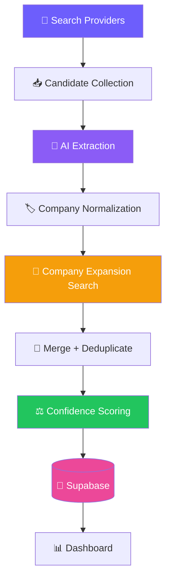

# 🎓 Build LayoffScout AI — Step-by-Step Tutorial

> A complete, beginner-friendly walkthrough. By the end you'll have a live Streamlit app that discovers companies having layoffs across multiple search providers, reads each post with AI, scores companies by confidence, and stores everything in a database — deployed for free.

> ⭐ **Star the repo:** https://github.com/adityasharmadotai-hash/amazing-ai-agents
> 💼 **Follow on LinkedIn:** https://www.linkedin.com/in/aditya-hicounselor/
> 📺 **Subscribe on YouTube:** https://www.youtube.com/channel/UCPjQtVNUrf7EKrm8ZoqrCAQ
> 🚀 **Looking for jobs at top AI companies in the U.S.?** [Apply here](https://docs.google.com/forms/d/e/1FAIpQLSc3gJssBV3B25EZ3sYA7Qcen9NbtOB_wgQaturfB7lTXuAdLQ/viewform)

---

## 📑 Table of Contents

1. [What We're Building and Why](#1-what-were-building-and-why)
2. [How It Works](#2-how-it-works)
3. [Prerequisites Checklist](#3-prerequisites-checklist)
4. [Project Setup](#4-project-setup)
5. [The Files, Explained (with code)](#5-the-files-explained-with-code)
   - [5.1 `agent/llm.py` — the shared AI client](#51-agentllmpy--the-shared-ai-client)
   - [5.2 `agent/config.py` — settings & the query dictionary](#52-agentconfigpy--settings--the-query-dictionary)
   - [5.3 `agent/sources/` — the provider interface](#53-agentsources--the-provider-interface)
   - [5.4 `agent/extract.py` — post → structured data](#54-agentextractpy--post--structured-data)
   - [5.5 `agent/companies.py` — normalization & confidence](#55-agentcompaniespy--normalization--confidence)
   - [5.6 `agent/discovery.py` — the expansion engine](#56-agentdiscoverypy--the-expansion-engine)
   - [5.7 `agent/pipeline.py` — the two-pass orchestrator](#57-agentpipelinepy--the-two-pass-orchestrator)
   - [5.8 `agent/store.py` — saving to Supabase](#58-agentstorepy--saving-to-supabase)
   - [5.9 `views/dashboard.py` + `streamlit_app.py` — the UI](#59-viewsdashboardpy--streamlit_apppy--the-ui)
6. [How to Run Locally](#6-how-to-run-locally)
7. [How to Deploy on Streamlit Cloud](#7-how-to-deploy-on-streamlit-cloud)
8. [Common Errors and Fixes](#8-common-errors-and-fixes)
9. [What You Learned](#9-what-you-learned)
10. [What's Next](#10-whats-next)

---

## 1. What We're Building and Why

We're building **LayoffScout AI** — a system that automatically discovers companies having layoffs and surfaces the affected talent, focused on **San Francisco & California**.

**The core insight:** the hard part is *not* reading a post — any modern LLM does that. The hard part is **discovery**: reliably *finding* the posts, especially from **small startups** that never appear on layoffs.fyi or in the news. So this project is a **search-and-coverage** problem that uses an LLM for one step, not an "LLM project."

By the end you'll understand a real production pattern: **multiple search providers → AI extraction → normalization → expansion → confidence scoring → database → dashboard.**

---

## 2. How It Works



One scan runs **two passes**:
- **Pass 1** searches a dictionary of layoff phrases across every provider you have a key for.
- **Pass 2** takes the companies it just discovered and searches *for each one directly* to find more posts.

---

## 3. Prerequisites Checklist

- [ ] **Python 3.12** installed (`python --version`)
- [ ] A code editor (VS Code recommended)
- [ ] A free **Google Gemini** API key → https://aistudio.google.com/app/apikey
- [ ] A free **Supabase** account → https://supabase.com
- [ ] At least one search key: **SerpAPI** (easiest/free tier), **Apify**, or **Perplexity**
- [ ] Basic comfort with the terminal (copy/paste is fine!)

> [!TIP]
> Start with just **Gemini + Supabase + SerpAPI**. You can add Apify and Perplexity later — the app merges whatever keys you provide.

---

## 4. Project Setup

```bash
# 1. Clone
git clone https://github.com/adityasharmadotai-hash/amazing-ai-agents.git
cd amazing-ai-agents/agents/layoff-detection-linkedin

# 2. Create a virtual environment
python -m venv .venv
source .venv/bin/activate        # Windows: .venv\Scripts\activate

# 3. Install dependencies
pip install -r requirements.txt

# 4. Copy the env template
cp .env.example .env
```

Now open `.env` and fill in the three **required** keys (`GEMINI_API_KEY`, `SUPABASE_URL`, `SUPABASE_SERVICE_KEY`) plus at least one search key. Then, in the Supabase **SQL Editor**, run both `supabase/layoff_posts.sql` and `supabase/companies.sql` to create the tables.

---

## 5. The Files, Explained (with code)

The app is organized as a small **`agent/`** package (all the logic) plus a thin **`views/`** UI layer. Data flows one way: providers → extraction → companies → store → dashboard.

### 5.1 `agent/llm.py` — the shared AI client

Every AI call goes through one function, so there's exactly one place that talks to Gemini.

```python
def complete_json(system: str, user: str) -> dict | list:
    """Send a prompt and parse the model's reply as JSON.
    Retries up to 3x only on non-JSON replies; API errors propagate immediately."""
    _ensure_configured()
    genai = _get_genai()
    model = genai.GenerativeModel(
        config.GEMINI_MODEL,
        system_instruction=system,
        generation_config={"response_mime_type": "application/json"},
    )
    resp = model.generate_content(user)
    raw = _strip_code_fence(resp.text or "")
    return json.loads(raw)
```

**Key ideas:**
- `response_mime_type="application/json"` forces Gemini to return valid JSON — no fragile text parsing.
- `google.generativeai` is imported **lazily** (inside a function). Importing it at startup pulls in heavy C-extensions that were crashing the Streamlit Cloud health check.

### 5.2 `agent/config.py` — settings & the query dictionary

All configuration comes from **environment variables**, computed once in a `refresh()` function so the Settings page can change a key and re-read live. The heart of discovery is the **query dictionary** — many phrases, each searched *independently*:

```python
QUERY_DICTIONARY = {
    "employee": [
        '"today was my last day"', '"my last day at"', '"my final day"',
        '"I got laid off"', '"impacted by the layoffs"', '"open to work"', ...
    ],
    "company": ['"layoffs"', '"reduction in force"', '"workforce reduction"', ...],
    "startup": ['"cash runway"', '"burn reduction"', '"strategic restructuring"', ...],
    "hashtag": ['#layoffs', '#layoff', '#opentowork'],
}
```

**Why this matters:** the original app used a few broad boolean queries. Employee language like `"today was my last day"` is how you find *small startups* — those posts name the employer, and the LLM extracts it. `config.py` also holds the expansion + budget knobs:

```python
EXPANSION_ENABLED = _bool("EXPANSION_ENABLED", True)
EXPANSION_MAX_COMPANIES = _int("EXPANSION_MAX_COMPANIES", 10)
EXPANSION_QUERIES_PER_COMPANY = _int("EXPANSION_QUERIES_PER_COMPANY", 3)
SCAN_BUDGET_USD = _float("SCAN_BUDGET_USD", 3.0)   # hard ceiling for expansion
```

### 5.3 `agent/sources/` — the provider interface

Every provider exposes the **same function shape**, so adding a new one is trivial and the orchestrator can merge them. Each returns a list of `{"url", "text", "source", "provider"}`:

```python
def search_linkedin_posts(queries: list[str] | None = None) -> list[dict]:
    ...
```

The orchestrator in `linkedin.py` runs every active provider concurrently and de-dupes across them by normalized URL:

```python
def search_linkedin_posts(queries=None) -> list[dict]:
    sources = config.active_sources()          # e.g. ["serpapi", "apify", "perplexity"]
    results = []
    with ThreadPoolExecutor(max_workers=max(2, len(sources))) as pool:
        futs = {pool.submit(_run, s): s for s in sources}
        for fut in as_completed(futs):
            results.extend(fut.result())
    # keep the richest text on URL collision
    best = {}
    for r in results:
        key = _norm_url(r.get("url"))
        if key and (key not in best or len(r["text"]) > len(best[key]["text"])):
            best[key] = r
    return list(best.values())
```

**The providers:**

| Provider | Strength | Weakness |
| --- | --- | --- |
| **SerpAPI** | Cheap, easy | Thin snippets; only Google-indexed posts |
| **Apify** | Full post text, most volume | Paid per post |
| **Perplexity** | Real URLs + citations | Few results per query |
| **Gemini** | No extra key | ❌ Can't find LinkedIn posts (kept for extraction only) |
| **NewsAPI** | Named-company events | Only big companies |

### 5.4 `agent/extract.py` — post → structured data

This is where the LLM turns messy post text into a clean record. The prompt asks for exact JSON keys and — crucially — extracts the **employer from casual phrasing** and classifies the **poster's role**:

```text
- poster_role (string): "employee" / "recruiter" / "founder" / "company" / "news" / "other"
- company (string|null): the company where the layoff happened. Extract it even
  from casual phrasing — "my last day at ACME", "impacted by layoffs at Retell AI".
- location (string|null): city/state, e.g. "San Francisco, California"
- event_date (string|null): ISO date (YYYY-MM-DD) the layoff happened
```

A tiny but important trick — `slug_text()` recovers keywords from the **URL** itself when the snippet is thin:

```python
# .../posts/jane_i-was-impacted-by-the-layoffs-across-xbox-activity-7479...
# -> "i was impacted by the layoffs across xbox"
```

### 5.5 `agent/companies.py` — normalization & confidence

The company — not the post — is the primary entity. Two pure functions do the heavy lifting.

**Normalization** collapses name variants to one key:

```python
def normalize_key(name: str | None) -> str:
    # "Retell AI" / "Retell.ai" / "Retell, Inc." -> "retell ai" / "retell"
    s = name.strip().lower()
    s = re.sub(r"[^\w\s&-]", " ", s)                 # drop punctuation
    tokens = [t for t in s.split() if t and t not in _SUFFIXES]  # drop Inc/LLC/…
    return " ".join(tokens).strip()
```

**Confidence** is a **noisy-OR** over independent signals — many weak signals stack, one strong signal lands high:

```python
_WEIGHTS = {"news": 0.80, "company": 0.80, "founder": 0.70,
            "recruiter": 0.45, "employee": 0.38, "other": 0.12}

def confidence(counts: dict[str, int]) -> float:
    p_not_real = 1.0
    for role, n in counts.items():
        p_not_real *= (1.0 - _WEIGHTS.get(role, 0.12)) ** n
    return round(1.0 - p_not_real, 4)
```

> 1 employee post → **38%** · 1 news article → **80%** · 8 employees + 2 recruiters + 1 founder → **~99%**.

### 5.6 `agent/discovery.py` — the expansion engine

Once Pass 1 finds companies, this searches for each one directly — the biggest coverage win. A **budget governor** stops it from running away:

```python
def run_expansion(company_names, seen_urls, metrics):
    from .sources import linkedin
    budget = config.SCAN_BUDGET_USD
    for name in company_names[:config.EXPANSION_MAX_COMPANIES]:
        if budget and usage.current_cost() >= budget:      # ⛔ hard stop
            metrics["budget_hit"] = True
            break
        queries = expansion_queries(name)   # '"Retell AI" layoffs', etc.
        for c in linkedin.search_linkedin_posts(queries=queries):
            u = linkedin._norm_url(c["url"])
            if u and u not in seen_urls:      # only NEW posts
                seen_urls.add(u)
                out.append(c)
```

### 5.7 `agent/pipeline.py` — the two-pass orchestrator

`run_scan()` ties it all together: collect → extract (Pass 1) → expand → extract (Pass 2) → qualify → store → roll up companies. It also logs **first-pass vs expansion** counts:

```python
# PASS 1
candidates = _collect()
records = [process_candidate(c) for c in candidates]   # (threaded)

# PASS 2 — expansion
if config.EXPANSION_ENABLED and records:
    targets = discovery.select_companies(records)
    exp = discovery.run_expansion(targets, seen_urls, disc_metrics)
    records += [process_candidate(c) for c in exp]

# qualify (location gate), store, and rebuild the company rollup
for r in records:
    r["is_qualified"] = extract.is_relevant(r)
store.upsert_records(records)
companies.rebuild()
```

### 5.8 `agent/store.py` — saving to Supabase

We talk to Postgres via **raw `httpx` + PostgREST** (no ORM, no `supabase-py`). A key defensive detail: **validate typed columns** so one bad LLM value can't fail the whole batch:

```python
def _clean_date(v):
    # LLM sometimes returns "September 2025" or "" — a Postgres `date` column
    # rejects those and kills the ENTIRE batch. Coerce anything invalid to null.
    try:
        return date.fromisoformat(v.strip()).isoformat()
    except (ValueError, AttributeError):
        return None
```

Companies get their own rollup table with `confidence`, per-signal counts, and an `in_location` flag (used to filter the Companies view to SF/California).

### 5.9 `views/dashboard.py` + `streamlit_app.py` — the UI

`streamlit_app.py` is a thin router using **callable pages** (functions, not file paths — file paths break in a repo subdirectory on Streamlit Cloud):

```python
pages = [
    st.Page(dashboard.render, title="Dashboard", icon="🎯", default=True),
    st.Page(settings.render, title="Settings", icon="⚙️"),
]
st.navigation(pages).run()
```

`dashboard.py` renders the **Scan** button, the **Companies** and **Leads** tabs, cost metrics, and a single-post analyzer. Running a scan is one call:

```python
summary = run_scan()   # returns counts, cost, and discovery metrics
```

---

## 6. How to Run Locally

```bash
streamlit run streamlit_app.py
```

1. The app opens at `http://localhost:8501`.
2. Go to **⚙️ Settings** and confirm your keys show as set (a ✅ appears when all required keys are present).
3. Back on the **Dashboard**, click **⚡ Scan New Data**.
4. Watch the **🏢 Companies** and **🎯 Leads** tabs fill in, and check the **Spend** panel.

---

## 7. How to Deploy on Streamlit Cloud

1. Push your fork to GitHub.
2. Go to [share.streamlit.io](https://share.streamlit.io) → **Create app**.
3. Point it at `agents/layoff-detection-linkedin/streamlit_app.py`.
4. **Advanced settings → Python version → `3.12`** ⚠️ (see errors below — this one matters).
5. Deploy. Then open **⋮ → Settings → Secrets** and paste your keys in TOML form:

```toml
GEMINI_API_KEY = "AIza..."
SUPABASE_URL = "https://xxxx.supabase.co"
SUPABASE_SERVICE_KEY = "sb_secret_..."
SERPAPI_KEY = "..."
LINKEDIN_SOURCE = "all"
TARGET_LOCATIONS = "San Francisco, California | California"
```

6. Run the two Supabase migrations once (if you haven't).

---

## 8. Common Errors and Fixes

> [!WARNING]
> **Build fails compiling Pillow / pandas — `RequiredDependencyException: zlib`.**
> Streamlit Cloud picked Python **3.13/3.14**, which has no wheels for the pinned deps, so pip compiles from source and fails. **Fix:** set **Python version → 3.12** in Advanced settings and reboot.

> [!WARNING]
> **`Supabase upsert failed ... invalid input syntax for type date`.**
> The LLM returned a non-ISO date (`"September 2025"`). The current code sanitizes this automatically (`_clean_date`) — if you see it, pull the latest `store.py`.

> [!WARNING]
> **`column "company_key" does not exist`.**
> You haven't run the company migration. Run **`supabase/companies.sql`** in the SQL Editor.

> [!NOTE]
> **The Gemini source returns 0 posts.** This is expected — Google Search grounding can't reach individual LinkedIn posts. Use `LINKEDIN_SOURCE=all` (or SerpAPI / Apify / Perplexity). Gemini is used for *extraction*, not discovery.

> [!NOTE]
> **"Missing required keys" banner.** Add `GEMINI_API_KEY`, `SUPABASE_URL`, `SUPABASE_SERVICE_KEY` (and one search key) on the Settings page or in Secrets.

> [!NOTE]
> **"The AI rejected every request."** Your `GEMINI_API_KEY` is invalid or `GEMINI_MODEL` is wrong. Use a fresh key and `gemini-2.5-flash`.

---

## 9. What You Learned

- 🔍 **Search quality beats AI quality** — an LLM can't extract a post it never receives.
- 🏗️ **Architecture over prompts** — an expansion pass and a merge stage moved the needle more than any prompt tweak.
- 🔌 **A provider interface** makes multi-source discovery easy to extend.
- 🏷️ **Normalization & confidence** turn noisy posts into a clean, ranked company list.
- 🛡️ **Validate at the boundary** — one bad value shouldn't sink a whole batch.
- 💰 **Budget governors** keep combinatorial pipelines from draining your API keys.
- ☁️ **Deployment is engineering too** — pinning the Python version is not optional.

---

## 10. What's Next

- 🚀 **Better startup discovery** — weight the long tail so small companies surface.
- 🔁 **Continuous monitoring** — re-scan discovered companies on a schedule.
- 📍 **Improved location detection** — cut the "unknown location" rate.
- 🧠 **Semantic deduplication** — catch reposts, not just matching URLs.
- 🔌 **More providers** — the interface is ready; a new one is a single module.

---

<div align="center">

**You built a real Company Discovery Engine — not just an LLM wrapper.** 🎉
⭐ [Star the repo](https://github.com/adityasharmadotai-hash/amazing-ai-agents) · 💼 [Follow on LinkedIn](https://www.linkedin.com/in/aditya-hicounselor/)

</div>
