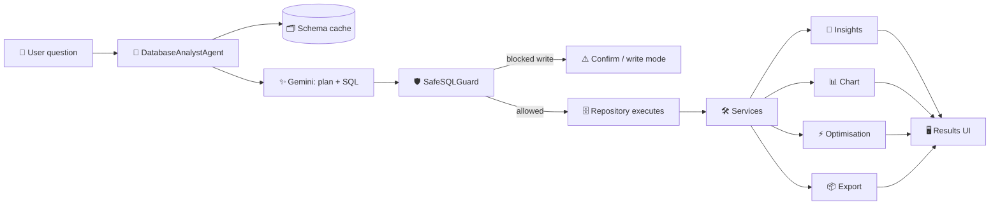

<!-- ===================== COMMUNITY LINKS ===================== -->
> ⭐ **Star the repo:** https://github.com/adityasharmadotai-hash/amazing-ai-agents
> 💼 **Follow on LinkedIn:** https://www.linkedin.com/in/aditya-hicounselor/
> 📺 **Subscribe on YouTube:** https://www.youtube.com/channel/UCPjQtVNUrf7EKrm8ZoqrCAQ
> 🚀 **Looking for jobs at top AI companies in the U.S.? Apply here:** https://docs.google.com/forms/d/e/1FAIpQLSc3gJssBV3B25EZ3sYA7Qcen9NbtOB_wgQaturfB7lTXuAdLQ/viewform
<!-- ========================================================== -->

---

# 🧠 AI Database Analyst — MCP Agent

> Chat with any SQL database in plain English — the AI inspects your schema, writes safe optimised SQL, runs it, explains the results, charts them, and exports reports.

🔗 **Live demo:** https://amazing-ai-agents.streamlit.app/
📖 **Step-by-step tutorial:** [TUTORIAL.md](https://github.com/adityasharmadotai-hash/docs-reader-rag-agent/blob/main/TUTORIAL.md) · (local copy: [TUTORIAL.md](TUTORIAL.md))

---

## 📌 Overview

Most people who need answers from a database can't write SQL — and even those who
can lose time hand-writing joins, remembering column names, and building charts.

**AI Database Analyst** removes that barrier. You connect a database, ask a
question like *"top 20 customers by revenue"*, and the agent:

1. reads your schema and figures out the relevant tables and relationships,
2. generates a correct, dialect-aware SQL query,
3. checks it against a safety guard (read-only by default),
4. executes it, then explains the results, draws the best chart, and offers
   one-click CSV / Excel / PDF / Markdown / JSON exports.

Every capability is also exposed as a **Model Context Protocol (MCP)** tool, so the
same schema reader, SQL executor, chart generator, etc. can be called
programmatically by other agents.

**The problem it solves:** turning natural-language questions into trustworthy,
explained, visualised database insights — safely, for both non-technical users
and busy analysts.

---

## ✨ Features

- 💬 **Natural language → SQL** with automatic schema + relationship discovery.
- 🛡️ **Safe by default** — read-only mode blocks `DROP`/`DELETE`/`UPDATE`/`TRUNCATE`/`ALTER`/`INSERT`; parameterised queries; multi-statement injection guard.
- 🧩 **10 MCP tools** — schema, table, column, index, relationship, statistics, SQL executor, CSV export, PDF export, chart generator (each independently callable over JSON-RPC).
- 📊 **Auto charts** — bar / line / pie / scatter / area / histogram / heatmap via interactive Plotly, with automatic chart-type selection.
- 🧠 **AI insights & reports** — executive summary, key metrics, recommendations, anomalies, opportunities.
- ⚡ **SQL optimisation** — index suggestions, `SELECT *` / JOIN warnings, query simplification, live execution-plan reading.
- 📦 **Exports** — CSV, Excel, JSON, Markdown, PDF.
- 🗄️ **Multi-database** — SQLite, MySQL, PostgreSQL, DuckDB, with pooling, validation, timeouts and auto-reconnect.
- ♻️ **Resilient AI** — auto-falls back to a supported Gemini model if the configured one is unavailable.
- 🧵 **Session memory** — conversation history, previous SQL/results, schema cache, saved queries, recent connections.
- 🌙 **Modern dashboard** — dark mode, responsive layout, metric cards.

---

## 🔄 How it works



**Plain English:** your question goes to the agent → the agent gives Gemini your
schema and gets back a query plan + SQL → the safety guard validates it → the
repository runs it → services turn the rows into insights, a chart, optimisation
tips and downloadable reports → the UI shows it all. The same steps are available
as standalone MCP tools.

---

## 🧰 Tech stack

| Layer | Technology | Why |
|---|---|---|
| UI | **Streamlit** | Fast, Python-native dashboards |
| LLM | **Google Gemini** (`google-generativeai`) | Natural-language → SQL & insights |
| Tool protocol | **Model Context Protocol (MCP)** | Independently-callable, typed tools |
| ORM / DB access | **SQLAlchemy 2** | One API across SQLite/MySQL/PostgreSQL/DuckDB |
| Drivers | **PyMySQL, psycopg2-binary, duckdb-engine** | Backend connectivity |
| Data | **pandas** | Result wrangling & stats |
| Charts | **Plotly** | Interactive visualisations |
| Validation | **Pydantic v2 / pydantic-settings** | Typed config & models |
| Exports | **openpyxl, XlsxWriter, reportlab** | Excel & PDF generation |
| SQL safety | **sqlparse** | Statement parsing & classification |
| Resilience | **tenacity** | Retry on transient LLM errors |
| Tests | **pytest** | Offline test suite (no API key) |

---

## 📂 File structure

```
ai-database-analyst-mcp/
├── streamlit_app.py          # Streamlit Cloud entry point (next to requirements.txt)
├── run.py                    # Local launcher / dual-mode entry point
├── app/                      # Streamlit UI
│   ├── main.py               # page assembly (header, sidebar, settings, chat)
│   ├── context.py            # dependency-injection container (AnalystContext)
│   └── components/           # sidebar, chat, results, charts, settings_panel
├── core/                     # config, models, exceptions, logging, session memory
├── agents/                   # gemini_client + database_analyst (the orchestrator)
├── mcp/                      # registry, tools (10), JSON-RPC stdio server
├── database/                 # connection, repository, schema_inspector, safe_sql
├── services/                 # chart, export, optimization, query, report
├── utils/                    # sql/format/validation helpers
├── prompts/                  # LLM prompt templates
├── scripts/                  # create_sample_db.py
├── tests/                    # pytest suite + fixtures
├── static/styles.css         # custom dark theme
├── exports/  logs/  sample_data/
├── requirements.txt          # runtime deps (loose pins, wheel-friendly)
├── requirements-dev.txt      # pytest etc.
├── .env.example   pytest.ini   README.md   TUTORIAL.md
```

---

## 🚀 Getting started

> Requires **Python 3.11+** (tested on 3.11–3.13).

```bash
# 1. Clone
git clone https://github.com/adityasharmadotai-hash/amazing-ai-agents.git
cd amazing-ai-agents/agents/mcp-agents/ai-database-analyst-mcp

# 2. Create & activate a virtual environment
python -m venv .venv
source .venv/bin/activate          # Windows: .venv\Scripts\activate

# 3. Install dependencies
pip install -r requirements.txt

# 4. Configure your key
cp .env.example .env               # Windows: copy .env.example .env
#   → open .env and set GEMINI_API_KEY (get one at https://aistudio.google.com/app/apikey)

# 5. Run
python run.py
```

Open <http://localhost:8501>. The SQLite sample database is created automatically
on first launch — just click **Connect** in the sidebar and ask a question.

You can also paste your API key directly into the in-app **⚙️ Settings** panel
(it opens automatically until a key is detected).

---

## ☁️ Deployment (Streamlit Community Cloud)

1. Push this repo to GitHub.
2. Go to <https://share.streamlit.io> → **Create app** → pick your repo/branch.
3. Set **Main file path** to:
   ```
   agents/mcp-agents/ai-database-analyst-mcp/streamlit_app.py
   ```
4. Under **Advanced settings → Secrets**, add:
   ```toml
   GEMINI_API_KEY = "your-key-here"
   ```
5. Click **Deploy**. The sample database is generated automatically on first run.

> **Build fails?** The only source-build-risky packages are `psycopg2-binary` and
> `duckdb`. For a SQLite-only demo you can safely comment those two lines out of
> `requirements.txt`.

---

## 🤝 Contributing

Contributions are welcome!

1. Fork the repo and create a feature branch: `git checkout -b feature/my-improvement`
2. Install dev deps: `pip install -r requirements-dev.txt`
3. Make your changes and **run the tests**: `pytest`
4. Keep the style consistent (type hints, docstrings, Pydantic models).
5. Open a Pull Request describing what and why.

Please don't commit secrets — the `.gitignore` excludes `.env`, logs and exports.

---

## 📄 License

Released under the **MIT License**. Provided as-is for educational and internal use.

---

## 📖 Tutorial

New here? Follow the full, beginner-friendly walkthrough:
**[TUTORIAL.md](https://github.com/adityasharmadotai-hash/docs-reader-rag-agent/blob/main/TUTORIAL.md)** (local copy: [TUTORIAL.md](TUTORIAL.md)).
