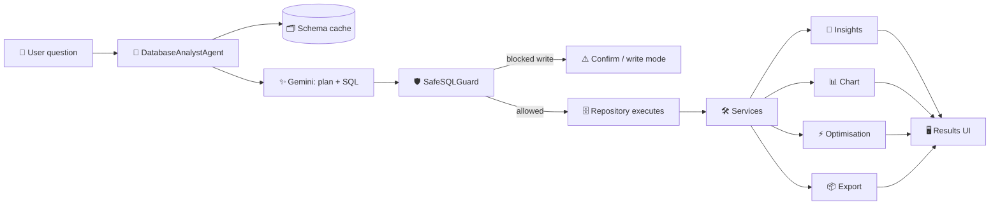

<!-- ===================== COMMUNITY LINKS ===================== -->
> ⭐ **Star the repo:** https://github.com/adityasharmadotai-hash/amazing-ai-agents
> 💼 **Follow on LinkedIn:** https://www.linkedin.com/in/aditya-hicounselor/
> 📺 **Subscribe on YouTube:** https://www.youtube.com/channel/UCPjQtVNUrf7EKrm8ZoqrCAQ
> 🚀 **Looking for jobs at top AI companies in the U.S.? Apply here:** https://docs.google.com/forms/d/e/1FAIpQLSc3gJssBV3B25EZ3sYA7Qcen9NbtOB_wgQaturfB7lTXuAdLQ/viewform
<!-- ========================================================== -->

---

# 📖 Build an AI Database Analyst (MCP Agent) — Step-by-Step Tutorial

A complete, beginner-friendly guide to building **AI Database Analyst** — an app that
lets anyone chat with a SQL database in plain English. By the end you'll understand
every part of the codebase and be able to run and deploy it yourself.

> No deep SQL or AI background needed — just basic Python. We explain every concept.

---

## 📑 Table of contents

1. [What we're building and why](#1-what-were-building-and-why)
2. [How it works](#2-how-it-works)
3. [Prerequisites checklist](#3-prerequisites-checklist)
4. [Project setup](#4-project-setup)
5. [The code, file by file](#5-the-code-file-by-file)
   - [5.1 Core — config, errors, models, logging, memory](#51-core)
   - [5.2 Database layer — safety, connection, inspection, repository](#52-database-layer)
   - [5.3 AI agent — Gemini client, prompts, orchestrator](#53-ai-agent)
   - [5.4 Services — charts, exports, optimisation, reports](#54-services)
   - [5.5 MCP layer — registry, tools, server](#55-mcp-layer)
   - [5.6 The Streamlit app — context, components, entry points](#56-the-streamlit-app)
   - [5.7 Sample database](#57-sample-database)
6. [How to run locally](#6-how-to-run-locally)
7. [How to deploy on Streamlit Cloud](#7-how-to-deploy-on-streamlit-cloud)
8. [Common errors and fixes](#8-common-errors-and-fixes)
9. [What you learned](#9-what-you-learned)
10. [What's next](#10-whats-next)

---

## 1. What we're building and why

**The problem:** databases hold the answers businesses need, but getting them out
requires writing SQL, knowing the schema, and building charts. That blocks
non-technical people and slows down analysts.

**What we're building:** a web app where you type a question like *"top 20 customers
by revenue"* and get back the SQL, the data, an interactive chart, an AI written
summary, optimisation tips, and downloadable reports — safely (it won't delete your
data by accident).

**The key ideas you'll learn:**

- Turning natural language into SQL with an LLM (Google Gemini).
- Making LLM output **safe** to execute (a read-only guard + injection protection).
- Inspecting a database schema so the AI knows the tables/columns.
- Exposing capabilities as **MCP tools** (the Model Context Protocol) so other
  programs can call them.
- Wiring it together with clean architecture: config, services, repository pattern
  and dependency injection.

---

## 2. How it works



**Flow in words:**
1. The user asks a question in the chat.
2. The **agent** loads the cached database schema.
3. It sends the schema + question to **Gemini**, which returns a *plan*: the intent,
   the relevant tables, and a single SQL statement.
4. The **SafeSQLGuard** validates the SQL — read-only statements pass; anything that
   modifies data is blocked unless write mode is on.
5. The **repository** executes the query with a row cap and timing.
6. **Services** turn the rows into insights, the best chart, optimisation tips and
   export files.
7. The **UI** shows everything in tabs.

---

## 3. Prerequisites checklist

- [ ] **Python 3.11+** installed (`python --version`)
- [ ] **pip** working (`pip --version`)
- [ ] A **Google Gemini API key** — free at https://aistudio.google.com/app/apikey
- [ ] A code editor (VS Code recommended)
- [ ] Basic comfort with the terminal and Python
- [ ] (Optional) a GitHub account if you want to deploy

---

## 4. Project setup

```bash
# Clone the monorepo and enter this project
git clone https://github.com/adityasharmadotai-hash/amazing-ai-agents.git
cd amazing-ai-agents/agents/mcp-agents/ai-database-analyst-mcp

# Create an isolated environment
python -m venv .venv
source .venv/bin/activate          # Windows: .venv\Scripts\activate

# Install dependencies
pip install -r requirements.txt

# Copy the env template and add your key
cp .env.example .env               # Windows: copy .env.example .env
```

Open `.env` and set:

```env
GEMINI_API_KEY=your-real-key-here
GEMINI_MODEL=gemini-2.0-flash
READ_ONLY_MODE=true
DB_TYPE=sqlite
DB_NAME=sample_data/northwind.db
```

That's it — the app creates the sample database for you on first run.

---

## 5. The code, file by file

The project follows a layered architecture. We'll go bottom-up: **core →
database → agent → services → MCP → app**. For large files we show the most
important sections with explanations; open the file in the repo for the rest.

### 5.1 Core

These files define configuration, error types, data shapes, logging and memory.

#### `core/config.py` — typed configuration

We never hard-code secrets. Configuration is loaded from environment variables /
`.env` into validated Pydantic models.

```python
class DatabaseType(str, Enum):
    SQLITE = "sqlite"
    MYSQL = "mysql"
    POSTGRESQL = "postgresql"
    DUCKDB = "duckdb"

class ConnectionConfig(BaseSettings):
    db_type: DatabaseType = DatabaseType.SQLITE
    host: str = "localhost"
    port: Optional[int] = None
    username: str = ""
    password: SecretStr = SecretStr("")   # SecretStr keeps it out of logs
    database: str = ""

    def build_url(self) -> str:
        """Return a SQLAlchemy connection URL (password URL-encoded)."""
        pwd = quote_plus(self.password.get_secret_value()) if self.password else ""
        if self.db_type == DatabaseType.SQLITE:
            return f"sqlite:///{self.database or ':memory:'}"
        if self.db_type == DatabaseType.POSTGRESQL:
            return f"postgresql+psycopg2://{self.username}:{pwd}@{self.host}:{self.port}/{self.database}"
        # ... mysql, duckdb similar
```

**Why it matters:** `SecretStr` prevents passwords from leaking into logs;
`build_url()` centralises the (fiddly) connection-string logic; one `AppSettings`
class holds every tunable (model name, timeouts, row caps, theme).

> 💡 Key detail: the default model is `gemini-2.0-flash` — older `gemini-1.5-*`
> aliases were retired by Google and now return 404s.

#### `core/exceptions.py` — a friendly error hierarchy

```python
class DatabaseAnalystError(Exception):
    default_message = "An unexpected error occurred."
    def __init__(self, message=None, *, detail=None):
        self.message = message or self.default_message
        self.detail = detail
        super().__init__(self.message)

class UnsafeSQLError(DatabaseAnalystError):
    default_message = "This statement was blocked in read-only mode."

class AIAgentError(DatabaseAnalystError): ...
class RateLimitError(AIAgentError): ...
class DBConnectionError(DatabaseAnalystError): ...
```

**Why:** one base class means the UI can catch `DatabaseAnalystError` and show a
clean message instead of a raw traceback, while still distinguishing specific
cases (unsafe SQL vs. rate limit vs. connection failure).

#### `core/models.py` — typed data contracts

Pydantic models that flow between layers: `ColumnInfo`, `TableInfo`, `SchemaInfo`,
`QueryResult`, `ChartSpec`, `QueryPlan`, `AnalysisResult`, `ChatMessage`. Example:

```python
class QueryResult(BaseModel):
    sql: str
    columns: list[str] = []
    rows: list[list[Any]] = []
    row_count: int = 0
    execution_time_ms: float = 0.0
    truncated: bool = False
    error: Optional[str] = None

    def to_records(self) -> list[dict]:
        return [dict(zip(self.columns, row)) for row in self.rows]
```

`SchemaInfo.to_prompt_text()` renders the schema into compact text we feed the LLM.

#### `core/logging_config.py` & `core/session.py`

- **logging_config.py** sets up console + rotating-file logging (`logs/app.log`) so
  we record questions, generated SQL, timings and errors.
- **session.py** is the in-memory store for one user session: conversation history,
  the schema cache, last SQL/result, saved queries and recent connections.

```python
class SessionMemory:
    def add_user_message(self, content): ...
    def set_schema(self, schema): self.schema_cache = schema
    def save_query(self, name, sql): self.saved_queries[name] = sql
    def recent_dialogue(self, turns=6) -> str: ...   # used for follow-up questions
```

---

### 5.2 Database layer

#### `database/safe_sql.py` — the safety guard (the most important file!)

This is what stops the AI from ever running a destructive query by accident.

```python
class SafeSQLGuard:
    def __init__(self, read_only: bool = True):
        self.read_only = read_only

    def validate(self, sql: str) -> SQLStatementType:
        statements = self.split_statements(sql)        # split on ';'
        if len(statements) > 1:
            # Multiple statements with any write = likely injection → block
            if any(self.classify(s) not in READ_ONLY_TYPES for s in statements):
                raise UnsafeSQLError("Multiple non-read statements are not allowed.")

        primary = self.classify(statements[0])         # SELECT? UPDATE? DROP?

        # Defence in depth: scan for destructive keywords even if obfuscated
        if self.read_only and _DANGEROUS_KEYWORDS.search(self.strip_comments(sql)):
            raise UnsafeSQLError("Destructive keyword blocked in read-only mode.")

        if primary in WRITE_TYPES and self.read_only:
            raise UnsafeSQLError(f"{primary.value} blocked in read-only mode.")
        return primary
```

**Plain English:**
- It splits the SQL into statements and classifies each (`SELECT`, `UPDATE`, `DROP`…).
- It rejects multi-statement payloads containing writes (a classic injection trick
  like `SELECT 1; DROP TABLE users`).
- It strips comments first, so a hidden `/* */ DROP` can't sneak through.
- In read-only mode (the default), any write/DDL statement is blocked.

#### `database/connection.py` — connection management

Wraps SQLAlchemy engine creation with **pooling**, **timeouts**, **auto-reconnect**
(`pool_pre_ping=True`) and **friendly errors**.

```python
class ConnectionManager:
    def connect(self) -> Engine:
        self._engine = self._build_engine()
        self.validate()           # runs SELECT 1; raises AuthenticationError /
        return self._engine       # ConnectionTimeoutError / DBConnectionError
```

The `validate()` method translates raw SQLAlchemy `OperationalError`s into our own
exception types by inspecting the message ("access denied" → `AuthenticationError`,
"timeout" → `ConnectionTimeoutError`).

#### `database/schema_inspector.py` — reading the schema

Uses SQLAlchemy's `inspect()` to read tables, columns, primary/foreign keys, indexes
and (approximate) row counts into a `SchemaInfo`. It also powers *"which tables
contain email?"*:

```python
def find_tables_with_column(self, schema, keyword):
    return [f"{t.name}.{c.name}"
            for t in schema.tables for c in t.columns
            if keyword.lower() in c.name.lower()]
```

#### `database/repository.py` — the single safe gateway (Repository pattern)

Every read/write goes through here. It validates with the guard, binds parameters
(no string concatenation → no injection), caps rows and records timing.

```python
def execute(self, sql, params=None) -> QueryResult:
    stmt_type = self.guard.validate(sql)               # safety first
    start = time.perf_counter()
    with self.engine.connect() as conn:
        self._apply_statement_timeout(conn)            # per-DB timeout
        cursor = conn.execute(text(sql), params or {}) # parameterised
        if cursor.returns_rows:
            rows = cursor.fetchmany(self.max_result_rows + 1)
            truncated = len(rows) > self.max_result_rows
            ...
    return QueryResult(sql=sql, columns=..., rows=..., execution_time_ms=...)
```

It also exposes `explain()` (reads the DB execution plan) and `sample_rows()`.

---

### 5.3 AI agent

#### `prompts/templates.py` — what we tell the model

Plain string templates kept out of the code so they're easy to tune. The key one
forces **strict JSON** output:

```text
Respond with a SINGLE JSON object and nothing else:
{
  "intent": "...",
  "relevant_tables": ["..."],
  "sql": "<a single valid {dialect} SQL statement>",
  "explanation": "...",
  "is_write": <true/false>,
  "assumptions": ["..."]
}
```

#### `agents/gemini_client.py` — talking to Gemini safely

A thin wrapper that handles config, retries, JSON extraction, and — importantly —
**auto-falls back to a supported model** if the configured one is unavailable.

```python
class GeminiClient:
    def __init__(self, api_key, model="gemini-2.0-flash", temperature=0.2, max_tokens=4096):
        self.model_name = self._normalise_model(model)
        self._configure(api_key)

    def complete(self, prompt, *, temperature=None, max_tokens=None) -> LLMResponse:
        try:
            return self._generate(prompt, cfg)
        except AIAgentError as exc:
            # Model retired/unavailable? list models, pick a good one, retry once.
            if self._is_model_not_found(exc.detail or "") and not self._resolved:
                if self._resolve_supported_model():
                    return self._generate(prompt, cfg)
            raise
```

**Why this matters:** Gemini deprecates model aliases over time. Instead of breaking,
the client calls `list_models()`, prefers `gemini-2.5-flash` → `2.0-flash` → any
flash model, and retries. It also classifies errors correctly so a 404 isn't
reported as a "rate limit". `LLMResponse.extract_json()` robustly pulls the JSON out
even if the model wraps it in ```` ```json ```` fences.

#### `agents/database_analyst.py` — the orchestrator

This ties everything together: understand → plan → validate → execute → enrich.

```python
def answer(self, question, memory) -> AnalysisResult:
    schema = self._ensure_schema(memory)              # cache or read
    plan = self._plan(question, schema, memory)       # Gemini → QueryPlan(JSON)

    try:
        self.guard.validate(plan.sql)                 # safety gate
    except UnsafeSQLError as exc:
        plan.needs_confirmation = True                # ask before writing
        return AnalysisResult(question, plan, error=str(exc))

    result = self.repo.execute(plan.sql)              # run it
    analysis = AnalysisResult(question=question, plan=plan, result=result)
    self._enrich(question, analysis)                  # insights + chart + tips
    return analysis
```

`_enrich()` adds: optimisation suggestions, an AI insights paragraph, an SQL
explanation (if auto-explain is on), and a chart spec (if auto-charts is on). For
charts it asks the LLM for the best chart type and falls back to a heuristic.

---

### 5.4 Services

Each service is a focused, reusable unit (Service-layer pattern).

- **`services/chart_service.py`** — `recommend()` picks a chart type from the data
  shape (datetime + number → line; one category + number → pie/bar; two numbers →
  scatter; etc.) and `build_figure()` returns an interactive Plotly figure.
- **`services/export_service.py`** — `to_csv / to_excel / to_json / to_markdown /
  to_pdf`. The PDF uses ReportLab to render a titled report with a data table.
- **`services/optimization_service.py`** — static analysis (warns about `SELECT *`,
  missing `LIMIT`, leading-wildcard `LIKE`, functions on columns, comma joins) plus
  **missing-index suggestions** by matching `WHERE`/`JOIN` columns against the schema,
  and reads the real execution plan.
- **`services/query_service.py`** — `statistics()` (min/max/mean/nulls/distinct per
  column) and `relationships()` (explicit FKs + inferred `<table>_id` links).
- **`services/report_service.py`** — turns a result into a full executive report
  using the LLM (with a deterministic fallback when no key is set).

Example — the chart recommender's core idea:

```python
def recommend(self, result) -> ChartSpec:
    df = self.to_dataframe(result)
    numeric = self._numeric_columns(df); dates = self._datetime_columns(df)
    if dates and numeric:        return ChartSpec(ChartType.LINE, x=dates[0], y=numeric[:3])
    if categorical and numeric:  return ChartSpec(ChartType.PIE if rows<=8 else ChartType.BAR, ...)
    ...
```

---

### 5.5 MCP layer

The **Model Context Protocol** lets us expose each capability as a typed,
independently-callable tool. We implement it natively (no external SDK needed).

#### `mcp/registry.py` — tools + dispatch

```python
@dataclass
class MCPTool:
    name: str
    description: str
    input_schema: dict          # JSON Schema for the arguments
    handler: Callable

class MCPToolRegistry:
    def list_tools(self):                       # MCP "tools/list"
        return [t.to_spec() for t in self.tools.values()]
    def call(self, name, arguments):            # MCP "tools/call"
        tool = self.get(name)
        tool.validate_arguments(arguments)
        return MCPToolResult(ok=True, tool=name, data=tool.handler(arguments))
```

#### `mcp/tools.py` — the 10 tools

`build_registry(...)` wires the services into tools. Example tool:

```python
def _sql_executor(args):
    result = repository.execute(args["sql"], args.get("params") or {})
    return _result_to_dict(result)

registry.register(MCPTool(
    name="sql_executor",
    description="Safely execute a SQL statement (read-only unless write mode).",
    input_schema={"type": "object",
                  "properties": {"sql": {"type": "string"}},
                  "required": ["sql"]},
    handler=_sql_executor,
))
```

The full set: `schema_reader`, `table_inspector`, `column_inspector`, `sql_executor`,
`index_inspector`, `relationship_analyzer`, `statistics_collector`, `csv_export`,
`pdf_export`, `chart_generator`.

#### `mcp/server.py` — JSON-RPC over stdio

Lets other programs call the tools. Run `python -m mcp.server` and send:

```json
{"jsonrpc":"2.0","id":1,"method":"tools/list"}
{"jsonrpc":"2.0","id":2,"method":"tools/call","params":{"name":"sql_executor","arguments":{"sql":"SELECT COUNT(*) FROM customers"}}}
```

```python
def _dispatch(self, method, params):
    if method == "tools/list":  return {"tools": self.registry.list_tools()}
    if method == "tools/call":
        res = self.registry.call(params["name"], params.get("arguments") or {})
        return {"content": [{"type": "text", "text": json.dumps(res.data)}],
                "isError": not res.ok}
```

---

### 5.6 The Streamlit app

#### `app/context.py` — dependency injection container

One function builds the entire wired object graph for a connection, so the UI never
constructs services by hand (easy to test, easy to swap pieces).

```python
def create_context(config, settings, *, api_key=None, memory=None) -> AnalystContext:
    cm = ConnectionManager(config); cm.connect()
    guard = SafeSQLGuard(read_only=settings.read_only_mode)
    repo = DatabaseRepository(cm, guard=guard, max_result_rows=settings.max_result_rows)
    llm = build_llm(settings, api_key=api_key)        # None if no key
    agent = DatabaseAnalystAgent(repo, llm, ChartService(...), OptimizationService(repo), guard)
    registry = build_registry(repo, QueryService(repo), ...)
    return AnalystContext(... all of the above ...)
```

#### `app/components/` — the UI

- **`sidebar.py`** — connection form (type/host/port/user/password/database),
  Connect/Disconnect, recent connections, saved queries.
- **`settings_panel.py`** — API key, model dropdown, temperature, max tokens, chart
  theme, auto-explain/auto-charts and **write mode**. It auto-opens until a key is
  detected.
- **`chat.py`** — the chat input, example chips, manual-SQL box, and renders history.
- **`results.py`** — metric cards + tabs (Results / Chart / Insights / Recommendations
  / SQL & Plan) + download buttons + the write-confirmation flow.
- **`charts.py`** — renders the Plotly figure with a chart-type switcher.

#### `app/main.py` — assembling the page

```python
def main():
    settings = get_settings()
    configure_logging(...)
    _ensure_sample_db(settings)            # creates the demo DB if missing
    st.set_page_config(page_title="AI Database Analyst", layout="wide")
    _load_css()
    render_sidebar(settings)
    render_settings(settings)
    render_chat()

if __name__ == "__main__":
    main()
```

#### `streamlit_app.py` & `run.py` — entry points

`streamlit_app.py` sits next to `requirements.txt` (so Streamlit Cloud finds deps)
and **calls** `main()` on every rerun (importing for side effects would render only
once → blank page):

```python
from app.main import main
main()
```

`run.py` is dual-mode: under Streamlit it renders the app; with plain
`python run.py` it launches Streamlit for you.

```python
if _in_streamlit_runtime():
    from app.main import main; main()
elif __name__ == "__main__":
    _launch_cli()          # subprocess: streamlit run app/main.py
```

---

### 5.7 Sample database

`scripts/create_sample_db.py` builds a tiny e-commerce SQLite DB so the example
questions work immediately:

```python
cur.executescript("""
  CREATE TABLE customers (customer_id INTEGER PRIMARY KEY, name TEXT, email TEXT, country TEXT, created_at TEXT);
  CREATE TABLE orders (order_id INTEGER PRIMARY KEY, customer_id INTEGER, employee_id INTEGER,
                       order_date TEXT, status TEXT, FOREIGN KEY (customer_id) REFERENCES customers(customer_id));
  -- products, order_items, employees, users ...
""")
```

It seeds realistic data — including some orders dated *today*, duplicate user emails,
and inactive users — so questions like *"today's sales"* and *"find duplicate users"*
return meaningful results.

---

## 6. How to run locally

```bash
# from the project folder, with your venv active and .env set:
python run.py
# or
streamlit run streamlit_app.py
```

1. Open <http://localhost:8501>.
2. Paste your Gemini key in the **⚙️ Settings** panel (it auto-opens) → **Apply**.
3. In the sidebar, keep `sqlite` and `sample_data/northwind.db` → **Connect**.
4. Ask: **`Top 20 customers by revenue`** and explore the result tabs.

Run the offline tests any time:

```bash
pip install -r requirements-dev.txt
pytest
```

---

## 7. How to deploy on Streamlit Cloud

1. Push your fork to GitHub.
2. Go to <https://share.streamlit.io> → **Create app** → select repo + branch.
3. **Main file path:**
   ```
   agents/mcp-agents/ai-database-analyst-mcp/streamlit_app.py
   ```
4. **Advanced settings → Secrets:**
   ```toml
   GEMINI_API_KEY = "your-key-here"
   ```
5. **Deploy.** The sample DB is generated on first run; open the app, Connect, and ask.

---

## 8. Common errors and fixes

| Error / symptom | Cause | Fix |
|---|---|---|
| **Error installing requirements** (cloud) | Exact pins lack wheels for the host Python, or a heavy/unused dep | Use this folder's `requirements.txt` (loose pins). For SQLite-only, remove `psycopg2-binary` and `duckdb`. |
| **Blank white screen** (cloud) | Entry point imported the app once instead of calling `main()` each rerun | Use `streamlit_app.py` (or `run.py`) as the Main file path and **Reboot**. |
| **`404 ... gemini-1.5-flash is not found`** | Model alias retired for your key | Pick `gemini-2.0-flash` in Settings — the app also auto-falls back. |
| **"AI provider rate limit reached"** | Gemini quota hit | Wait and retry, or use a higher-quota key. |
| **"blocked in read-only mode"** | You asked for a write while read-only (the default) | Enable **write mode** in Settings, then confirm the action. |
| **Connection failed / timeout** | Wrong host/port/credentials, or DB not reachable | Re-check sidebar fields; ensure cloud DBs allow external connections. |
| **No insights / charts** | No API key configured | Add `GEMINI_API_KEY` (Settings or secrets). |

Logs are written to `logs/app.log`.

---

## 9. What you learned

By building this project you practised:

- ✅ Turning natural language into SQL with an LLM and **structured JSON output**.
- ✅ Making LLM output **safe to execute** (statement classification, injection guard,
  read-only mode).
- ✅ **Schema inspection** and feeding it to the model as context.
- ✅ The **repository pattern**, **service layer** and **dependency injection** for clean,
  testable code.
- ✅ Typed configuration and models with **Pydantic** (and keeping secrets safe).
- ✅ Building a **Model Context Protocol** tool layer with discovery + typed invocation.
- ✅ Interactive data apps with **Streamlit** and charts with **Plotly**.
- ✅ Generating **CSV/Excel/PDF/Markdown** exports and AI reports.
- ✅ **Deploying** a multi-file Streamlit app to the cloud and debugging real issues.

---

## 10. What's next

Ideas to extend the project:

- 🔐 **Per-user auth** and saved connection profiles in a small database.
- 🧠 **Caching** LLM plans for repeated questions to cut cost/latency.
- 📈 **Dashboards** — pin multiple charts into a saved dashboard view.
- 🗣️ **Voice input** for questions.
- 🧪 **More tests** — add agent-level tests with a mocked LLM.
- 🔌 **More MCP tools** — data profiling, anomaly detection, scheduled reports.
- 🌐 **More databases** — Snowflake, BigQuery, Redshift via SQLAlchemy dialects.
- 🤖 **Multi-agent** — let another agent consume these MCP tools to automate analysis.

---

> ⭐ If this helped you, **star the repo**, follow on LinkedIn, and subscribe on
> YouTube (links at the top). Happy building!
