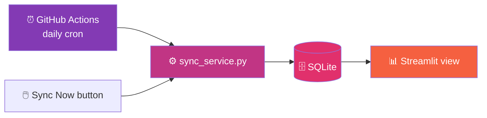
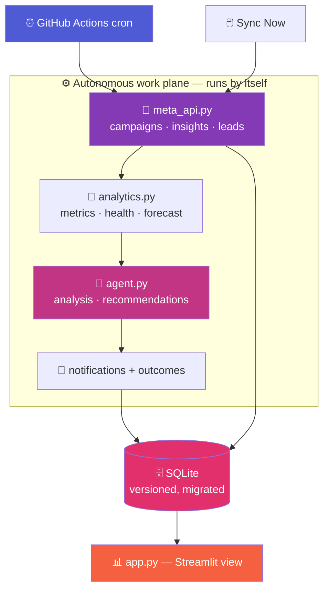
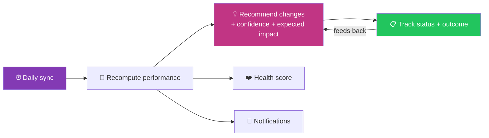
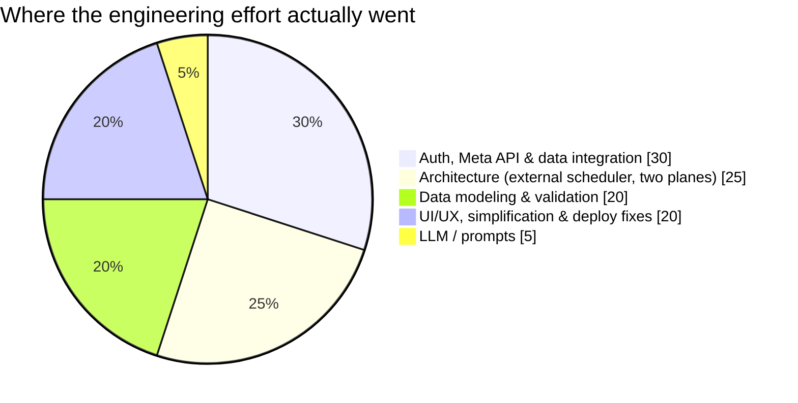

# 🛠️ The Engineering Journey Behind the Instagram AI Ad Manager

> A first-person case study of building an AI agent that watches Instagram ad campaigns and improves them every day — including the assumptions that were wrong, the numbers that lied, and the bug that only showed up in production.

This is **not** a README. It's the story of how a simple "call the Meta API, call Gemini, draw a dashboard" idea turned into a **self-running marketing agent** — and the surprisingly un-glamorous engineering that decided whether it worked. If you're here for the honest version: the hardest parts had almost nothing to do with the AI.

---

## 📑 Table of Contents

1. [Why I Built This](#1--why-i-built-this)
2. [My Initial Assumption](#2--my-initial-assumption)
3. [The First Prototype](#3--the-first-prototype)
4. [The Realization That Reframed Everything](#4--the-realization-that-reframed-everything)
5. [Do the Math in Code, Let the Model Talk](#5--do-the-math-in-code-let-the-model-talk)
6. [When the Numbers Lied](#6--when-the-numbers-lied)
7. [Engineering Challenges](#7--engineering-challenges)
8. [The Architecture Evolution](#8--the-architecture-evolution)
9. [The Self-Serving Agent](#9--the-self-serving-agent)
10. [The Meta Access Saga](#10--the-meta-access-saga)
11. [The Bug That Only Existed in Production](#11--the-bug-that-only-existed-in-production)
12. [Making It Simple](#12--making-it-simple)
13. [Lessons Learned](#13--lessons-learned)
14. [Technical Stack](#14--technical-stack)
15. [Future Roadmap](#15--future-roadmap)
16. [Final Thoughts](#16--final-thoughts)
17. [Contributing](#17--contributing)

---

## 1. 🎯 Why I Built This

A recruiting client runs Instagram lead-gen ads to reach **job seekers in San Francisco and the Bay Area**. Someone on the team (Divya) had already created the ads and run them for a few weeks — real spend, real leads, real results. The ask was sharp:

> **Build an AI agent that watches our whole Instagram campaign, tells us every day what to change, checks whether the change actually worked, monitors every lead, learns from our feedback on those leads, and gives us a dashboard we can filter by date and by week.**

And one line that turned out to define the entire architecture:

> *"It should be a self-serving agent. That means it runs by itself."*

I filed that under "easy" at the start. It was not.

---

## 2. 💡 My Initial Assumption

My first mental model was three boxes and a shrug:

```text
Meta API  →  Gemini  →  Dashboard
```

The plan felt obvious: pull the campaigns and leads from the Meta Marketing API, hand the numbers to Gemini for analysis and recommendations, and render it all in Streamlit. The "runs by itself" requirement? *I'll just add a scheduler inside the app.*

> [!NOTE]
> Two assumptions hid inside that plan, and both were wrong: (1) that Streamlit could *run itself* on a schedule, and (2) that I should let the LLM handle the numbers. Each one quietly shaped a bad first design.

---

## 3. 🧱 The First Prototype

The first version was a single Streamlit app that, on each page load, pulled data and asked Gemini to "analyze the campaigns." It worked in a demo. KPIs appeared. Gemini wrote paragraphs. It *looked* finished.


Then I tried to make it satisfy requirement #4 — *run by itself, every day* — and the design fell over.

---

## 4. 🔑 The Realization That Reframed Everything

I reached for the obvious thing: a background loop inside Streamlit that syncs and re-analyzes on a timer. It doesn't exist — and it *can't*.

> [!IMPORTANT]
> **Streamlit is a view, not a runtime.** A Streamlit script runs top-to-bottom **only when a browser session triggers it**, then exits. There is no always-on process, no cron, no background thread that survives. A "self-running agent" simply cannot live inside the app.

This is the Instagram-ads version of the lesson every real system teaches eventually: the requirement that sounds like a checkbox (*"runs daily"*) is actually an **architecture decision**. The autonomous part had to live **outside** the UI entirely.

So the agent split in two:

- **`sync.py` + `sync_service.py`** — a standalone job that does *all* the real work (pull data → analyze → recommend → verify → notify → store). It runs on **GitHub Actions on a daily cron** (or any cron / Task Scheduler).
- **The Streamlit app** — a pure *view* over the latest synchronized data, plus a manual **Sync Now** button that calls the exact same pipeline.



Once I stopped trying to make the UI run itself, everything got simpler. The app became dumb-and-fast; the intelligence moved to a job that can actually run unattended.

---

## 5. 🧮 Do the Math in Code, Let the Model Talk

My prototype asked Gemini to read raw rows and compute things like cost-per-lead and week-over-week change. That's the second bad assumption from §2, and it shows up as two problems: LLMs are **bad at arithmetic over many rows**, and they're **expensive and slow** when you dump raw data at them.

> [!TIP]
> **Separate the deterministic from the generative.** Metrics are math — compute them in Python where they're exact, testable, and free. Let the model do the thing it's uniquely good at: turning a compact set of *already-correct* numbers into plain-English judgement.

So I split the brain:

| Layer | Job | Where |
| --- | --- | --- |
| **`analytics.py`** | CTR, CPC, cost-per-lead, trends, week-over-week, health score, forecast — pure functions, no AI | deterministic |
| **`agent.py`** | reads a **compact JSON snapshot** of those numbers and writes analysis, recommendations, creative, chat | generative |

The agent never sees a raw database dump — it sees `build_stats_payload()`, a ~10 KB summary. That single boundary made the AI cheaper, faster, more accurate, and *reproducible* (the numbers don't change between runs, only the prose).

---

## 6. 📉 When the Numbers Lied

With the sample dataset wired up, I opened the dashboard and the cost-per-lead read **$990**. Something was very wrong.

> [!WARNING]
> A "$990 cost per lead" is the kind of bug that isn't a crash — it's a *plausible-looking wrong number*. Those are the dangerous ones, because a stakeholder will read it and either panic or lose trust in the whole tool.

Two separate data-modeling problems were hiding underneath.

### Problem 1 — ad-reported leads vs. real leads

The Meta *insights* API reports a `leads` action count (e.g. **4,606** over the window). But the *lead records* — the actual people with names/emails from lead forms — were only **140**. Cost-per-lead computed against one, the leads table showed the other, and nothing reconciled. I reworked the sample generator so **one CRM lead record exists per ad-reported lead**, and made the analytics explicit about which number feeds which metric. Now the dashboard and the leads table agree.

### Problem 2 — the rounding-to-zero trap

My generator computed daily leads per campaign per placement and did `int(round(...))`. For a low-budget, high-cost campaign, the *expected* leads on a given day were like `0.06` — which rounds to **0 every single day**. So the campaign accumulated spend but **zero** leads → cost-per-lead of `spend ÷ 0` → the $990 nonsense.

The fix was a **fractional-lead accumulator**: carry the remainder across days so `0.06/day` correctly becomes ~4 leads over 70 days instead of 0.

> [!TIP]
> **Integer rounding silently deletes small quantities.** Any time you bucket a small rate into discrete counts, carry the remainder — or your rare-but-real events vanish and every downstream ratio explodes.

After both fixes: total spend ~$5.2k, ~300 leads, average cost-per-lead **$17**, with realistic per-campaign spreads. Numbers that a marketer would actually believe.

---

## 7. 🧩 Engineering Challenges

The two big pivots were the headline. Underneath were the usual pile of unglamorous problems.

### 🔁 Cache invalidation without staleness
Reading SQLite on every rerun is wasteful; caching risks showing stale data after a sync. I added a **`data_version` counter** that every write bumps, and keyed Streamlit's `@st.cache_data` on it. Reads are cached *and* auto-refresh the instant anything changes — no manual cache-clearing, no stale dashboards.

### 🧬 Schema migrations on a live database
Adding confidence/impact columns to `recommendations`, plus `notifications` and `sync_log` tables, would break anyone's existing database. `init_db()` now runs **idempotent migrations** (`PRAGMA table_info` → `ALTER TABLE` only if missing), so upgrades don't wipe data.

### 🧾 A sync that can't half-fail
A sync pulls data *and* runs the AI. If Gemini hiccups, I didn't want to lose the freshly pulled campaigns. The pipeline degrades to a **`partial`** status: data is committed, the AI stage is skipped, and it's all recorded in `sync_log` — never an all-or-nothing crash.

### 💾 Persistence on an ephemeral disk
Streamlit Cloud's filesystem **resets on every redeploy**, so a local SQLite file evaporates. Two escape hatches: the GitHub Action **commits the refreshed database back** to the repo (which auto-redeploys the app with fresh data), and an `ADMANAGER_DB_PATH` env var points the job and app at one shared/persistent location.

### 🔔 Notifications without spam
Threshold alerts (cost-per-lead spikes, lead drops, top performers) could fire the same alert every sync. A **same-day dedupe** check means you get an alert once, not on every run.

---

## 8. 🏗️ The Architecture Evolution

The three-box prototype grew into a real two-plane system: an **autonomous work plane** and a **view plane**, meeting at the database.

### Old architecture


### New architecture



### Why each piece exists

| Piece | The problem it solves |
| --- | --- |
| **External scheduler** | Streamlit can't run itself — the autonomy lives in cron/Actions |
| **`sync_service.py`** | One pipeline shared by the cron job *and* the Sync Now button — no logic drift |
| **`analytics.py` (pure)** | Exact, testable numbers the LLM can't get wrong |
| **`agent.py` (compact input)** | Cheap, fast, reproducible AI over a summary, not raw rows |
| **`data_version` counter** | Cache speed without stale data |
| **Migrations + `sync_log`** | Safe upgrades and an audit trail of every run |

---

## 9. 🧠 The Self-Serving Agent

Requirement #4 — *"checks performance every day to ensure the change was made and delivered results"* — is the part that makes it an *agent* rather than a report. The loop:



Each recommendation carries a **confidence score** and an **expected impact**, and every day's new recommendations are generated *aware of how past ones turned out* — so the agent stops repeating advice that made things worse and doubles down on what worked.

> [!NOTE]
> **The honest gap:** outcome verification is currently *semi*-automatic — the structure tracks it and the AI reasons over it, but a human still confirms whether an implemented change actually improved results. Fully automatic before/after measurement (compare a campaign's metrics across the change date and set the outcome itself) is the next step on the roadmap. I'd rather ship an honest "assisted" loop than fake a fully-autonomous one.

---

## 10. 🔐 The Meta Access Saga

Requirement #1 is one sentence — *"the agent has access to our entire Instagram campaign."* Getting real data flowing turned out to be the single most time-consuming part, and **none** of it was code.

The sync failed with:

```text
(#200) Ad account owner has NOT granted ads_management or ads_read permission
```

> [!WARNING]
> **The hardest part of "access the campaign" is authorization, not the API call.** My client-side code was correct on the first try; the token simply didn't carry `ads_read`, and the token's user needed a *role* on the ad account. No amount of code fixes a missing permission.

What the journey actually required:
1. A Meta **Business app** with the **Marketing API** product added.
2. A token generated **with `ads_read` + `leads_retrieval`** (the default token only had `public_profile`).
3. The token's user assigned a **role on the specific ad account** (`act_…`).
4. For a *self-running* job, a **System User token** — because a normal long-lived token expires in ~60 days and would silently kill the daily sync.

The app was built to fail *gracefully* into this reality: a typed `MetaAPIError` surfaces the exact message, `is_configured()` gates the UI, and Settings has an in-app key form (kept in session memory, never written to disk).

> [!IMPORTANT]
> **I never handle the secrets.** Keys are pasted by the user into their own app / GitHub Secrets. When a live key showed up in chat, the right move was to say *rotate it* — not to use it. Credential boundaries are a feature, not a formality.

---

## 11. 🐞 The Bug That Only Existed in Production

I had a headless test harness (Streamlit's `AppTest`) driving all 13 pages, green across the board. Then the deployed app on Streamlit Cloud threw:

```text
StreamlitDuplicateElementId: st.plotly_chart ...  (Audience page)
```

Two charts on the same page received the **same auto-generated element ID** and Cloud rejected the duplicate. My local tests never caught it.

> [!WARNING]
> **Your test runtime is not your production runtime.** `AppTest` computed chart element IDs differently from the (newer, stricter) Streamlit on Cloud. A green local suite proved the *logic* worked — not that it would render on the actual deployment.

The fix: give every chart a **unique, stable key** via a per-**session** counter that resets at the top of each run. Per-session (not module-global) matters — on Cloud, multiple users share one process, and a global counter would let their runs interleave and collide again. I then added a test that asserts *every chart on every page has a unique key*, so this specific class of bug can't come back.

---

## 12. 🎚️ Making It Simple

I'd built the premium version to the hilt: 13 pages — dashboard, campaigns, leads, audience, creative studio, AI analysis, recommendations, forecast, health score, executive brief, notifications, assistant, settings. I was proud of it. The client's reaction:

> *"We no need complex product… I want easy to understand data."*

And they were right.

> [!TIP]
> **More features is not more value.** A tool the user finds overwhelming is a tool they won't use. Matching the product to the person beats maximizing the surface area.

Two changes:
- **Trimmed the menu to 7 core items** (dashboard, campaigns, leads, AI analysis, recommendations, assistant, settings). The six advanced pages still exist in the code — one line brings any of them back — but they're out of the way by default.
- **Rewrote the AI output to be short and plain** — a one-line takeaway, then three clean groups (*What's working · What needs fixing · What to do next*), max three points each, no jargon, no formatting glitches. The verbose wall-of-text became scannable.

The best feature I shipped that week was the ones I **hid**.

---

## 13. 🎓 Lessons Learned

> [!TIP]
> **1. "Runs by itself" is an architecture, not a checkbox.** Streamlit is a view; autonomy has to live in an external scheduler. Deciding *where the loop runs* is the real design.

> [!TIP]
> **2. Do the math in code; let the model do the talking.** Deterministic metrics in Python, plain-English judgement from the LLM. Cheaper, faster, exact, reproducible.

> [!TIP]
> **3. Plausible wrong numbers are worse than crashes.** A $990 cost-per-lead erodes trust silently. Reconcile your data definitions and carry your fractional remainders.

> [!TIP]
> **4. Auth is the hard part of "just connect the API."** The code was right in one try; permissions, roles, and token lifetimes took the time. Design for graceful auth failure.

> [!TIP]
> **5. Test on the runtime you deploy to.** A green local suite caught the logic but not the Cloud-only duplicate-ID crash. Match the target environment.

> [!TIP]
> **6. Simpler is a feature.** Trimming 13 pages to 7 and shortening the AI output made the product *better*, not weaker.

> [!WARNING]
> **7. Never handle the user's secrets.** Keys belong in the user's hands and their own Secrets store. If one leaks into a chat, the answer is "rotate it," not "use it."

---

## 14. 🧰 Technical Stack

| Technology | Role | Why |
| --- | --- | --- |
| 🐍 **Python** | Core language | Best ecosystem for data pipelines + LLM SDKs |
| 🎈 **Streamlit** | Dashboard & UI (view plane) | Fastest path to a shareable, interactive app |
| ✨ **Gemini 2.5 Pro** | AI reasoning | Strong plain-English analysis over compact JSON stats |
| 🔵 **Meta Marketing API** | Data source | Live campaigns, insights, and lead-ads (Graph API v21.0) |
| 🗄️ **SQLite** | Storage | Zero-config, file-based, migratable; shared by app + job |
| 📊 **Plotly + pandas + numpy** | Charts, metrics, forecasting | Deterministic analytics and themed visuals |
| ⏰ **GitHub Actions** | The autonomous scheduler | Runs `sync.py` daily; commits fresh data back |

> [!NOTE]
> The design is deliberately **two-plane**: an autonomous work plane (`sync_service`) and a view plane (`app.py`) meeting at the database. Nothing here is exotic — the value is in *where the work runs*, not in any single tool.

---

## 15. 🗺️ Future Roadmap

- [ ] **Fully automatic outcome verification** — measure each implemented change's before/after metrics and set the outcome without a human (closes the §9 gap).
- [ ] **True weekly view** — bucket the last 10 weeks into per-week spend/leads/cost-per-lead, with a "pick a week" filter.
- [ ] **Per-ad granularity** — pull insights at ad level (not just campaign) so spend shows per individual ad.
- [ ] **Write-back actions** — let the agent *apply* approved budget/status changes via the Marketing API, not just suggest them.
- [ ] **Durable storage** — swap SQLite for hosted Postgres so Cloud redeploys never reset data.
- [ ] **Creative fatigue detection** — flag ads whose CTR is decaying over time.
- [ ] **Alerting out** — push notifications to Slack/email on high-severity changes.

---

## 16. 💭 Final Thoughts

I started thinking this was "an LLM app." Call Gemini, get insight, ship a dashboard.

What building it actually taught me is that the AI was the *easy* part. The work that decided whether the agent was good lived everywhere else:



- **Auth & integration** — the `#200` saga, token scopes, System Users.
- **Architecture** — moving autonomy out of Streamlit into a real job.
- **Data modeling** — reconciling leads, killing the $990 cost-per-lead.
- **UI & deploy** — the Cloud-only chart bug, and cutting complexity in half.
- **LLM** — a compact stats boundary and a few tight prompts.

The model is a genuinely powerful *component*. But a powerful component in a weak system is still a weak system. The plumbing — where the loop runs, how the numbers reconcile, how it fails when a token is wrong — is what turns a demo into an agent someone trusts every morning.

If there's one line to take away: **the AI is one box in the system, and it's usually not the hard one.**

---

## 17. 🤝 Contributing

This is a real, in-progress system with an honest roadmap — a good place to contribute.

Good places to jump in:

- 🐛 **Open an issue** — a wrong number, a missed edge case, a deployment gotcha.
- 🔀 **Send a focused PR** — small and clear is welcome.
- 🤖 **Close the outcome-verification gap** — automatic before/after measurement is the highest-leverage feature on the roadmap.
- 📅 **Add the weekly view** — per-week buckets for the last 10 weeks.
- 🎯 **Per-ad insights** — pull `level=ad` and surface per-ad spend.

> [!NOTE]
> Contributions that improve **data correctness** and **autonomy** are worth more here than any model swap — because, as this whole journey argues, that's where the real problem lives.

---

<div align="center">

*Built honestly — assumptions broken, numbers reconciled, and the autonomous part moved to where it can actually run.*
**⭐ If this engineering story was useful, star the repo and share it.**

</div>
